# Tema 1. Arquitecturas paralelas: clasificación y prestaciones

## Lección 1. Clasificación del paralelismo implícito en una aplicación

_Dónde podemos encontrar paralelismo implícito en una aplicación que puedan aprovechar aplicaciones paralelas._

---

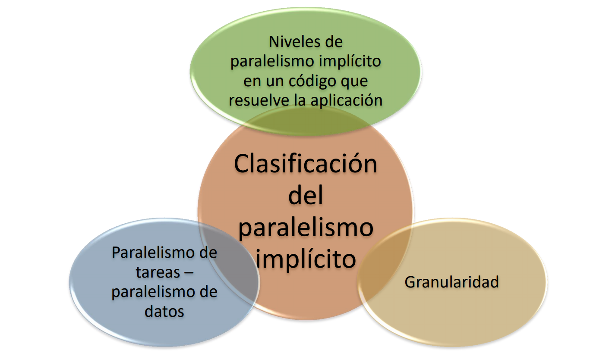

### Niveles y tipos de paralelismo implícito en una aplicación

**Código** es una descripción de la aplicación.

~~~c
Func1() {
    ...
}
Func2() {
    for() {
        ...
    }
    while() {
        ...
    }
}
Func3() {
    ...
}

main() {
    Func1();
    Func2();
    Func3();
}
~~~

Dentro del código secuencial se puede encontrar paralelismo implícito en los siguientes niveles de abstracción:

* **Nivel de programas:** los diferentes programas que intervienen en una aplicación o en diferentes aplicaciones que se pueden ejecutar en paralelo. Es poco probable que exista dependencia entre ellos.
* **Nivel de funciones:** en un nivel de absracción más bajo, un programa puede considerarse constituido por funciones. Las funciones llamadas en unprograma se pueden ejecutar en paralelo, siempre que no haya entre ellas dependencias (**riesgos**) inevitables; como dependencias de datos verdaderas (lecutra después de escritura).
* **Nivel de bucle (bloques):** una función puede estar basada en la ejecución de uno o varios bucles (`for`, `while`, `do-while`). El código dentro de un bucle se ejecuta múltiples veces, en cada iteración se completa una tarea. Se pueden ejecutar en paralelo las iteraciones de un bucle, siempre que se eliminen los problemas derivados de las dependencias verdaderas. Para detectar las dependencias habrá que analizar las entradas y salidas de las iteraciones del bucle.
* **Nivel de operaciones:** las operaciones independientes se pueden ejecutar en paralelo. Por otra parte, en los procesadores de propósito específico y en los de propósito general (por ejemplo, dentro de los repertorios multimedia) se pueden encontrar instrucciones compuestas de varias operaciones que se aplican en secuencia al mismo flujo de datos de entrada. En este nivel se puede detectar la posibilidad de usar instrucciones compuestas, que van a evitar las penalizaciones por dependencias verdaderas.

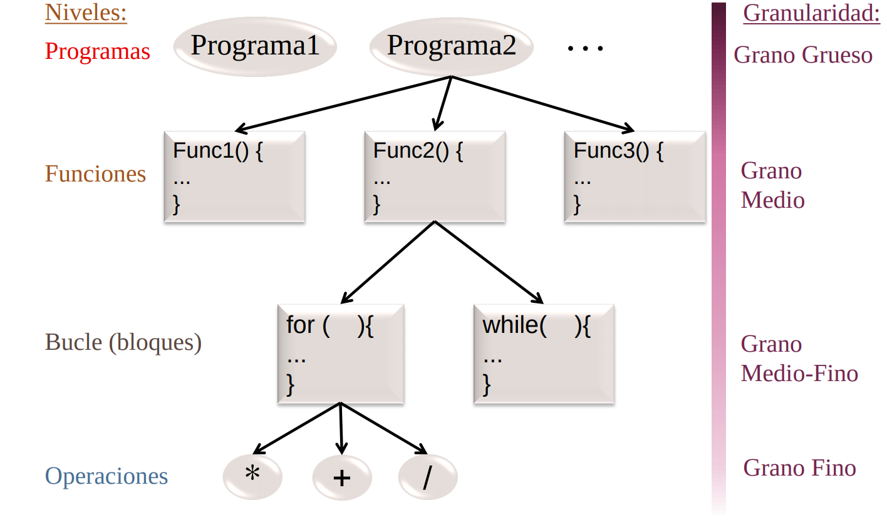

A este paralelismo que puede detectarse en los niveles de un código secuencial se le denomina **paralelismo funcional**.

- *Programas se comunican a través de ficheros.*

- *Funciones a través de variables.*

- *Bucles dividen el código en bloques, que contienen operaciones.*

  - *Hay operaciones que podemos ejecutar en paralelo: las que no tengan dependencias de datos.*

- ***Granularidad:*** *tamaño de trozos de código que se pueden ejecutar en paralelo.*

  Según el libro, el paralelismo también puede clasificarse en función de la **granularidad** o magnitud de la _tarea_ (número de operaciones) candidata a la paralelización, que suele hacer corresponder con los distintos niveles de paralelismo.

### Dependencias de datos

Son condiciones que se deben cumplir para que un bloque de código presente dependencia respecto a otro bloque.

- Bloque B2 tiene dependencia de datos con bloque B1 si:

  - Hacen referencia a una misma posición de memoria M (variable).
  - B1 aparece en la secuencia de código antes que B2.

- **RAW, _Read After Write_** o dependencia verdadera. Se produce cuando una instrucción utiliza como uno de sus operandos (lee) el resultado que se obtiene en una instrucción previa (escribe).

  ```ruby
  ¡V2! :=  V1  +  V2
   V1  := ¡V2! +  V3
  ```

- **WAW, _Write After Write_** o dependencia de salida. Se produce cuando es importante el orden de escritura.

  ```ruby
  ¡V2! :=  V1  +  V2
  ¡V2! :=  V4  +  V3
  ```

- **WAR, _Write After Read_** o antidependencia. Se produce porque la segunda instrucción escribe su resultado al lugar desde donde se lee uno de los operandos de la primera instrucción.

  ```ruby
   V2  := ¡V1!  +  V2
  ¡V1! :=  V2 +  V3
  ```

- *Podemos eliminar estas dependencias, ya sea compilador, programador o núcleo de procesamiento (a nivel de bloque, detecta problema cuando hay RAW y los evita).*

  - *Basta usar variables diferentes.*

### Paralelismo implícito en una aplicación

También clasificamos el paralelismo en **paralelismo de tareas** y **paralelismo de datos**.

* El **paralelismo de tareas** se encuentra extrayendo, generalmente de la definición de la aplicación, la estructura lógica de funciones de la aplicación (los bloques son fucniones y las conexiones entre ellos reflejan el flujo de datos entre funciones). Analizando esta estructura podemos encontrar paralelismo entre funciones. Equivaldría al paralelismo a **nivel de función** dentro del código de alto nivel.

  _Ejemplo: sucesión de funciones, que dependen una de otra._

  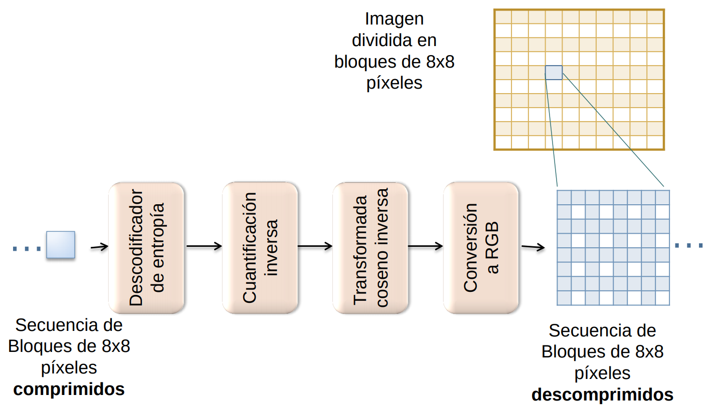

* El **paralelismo de datos** se encuentra implícito en las operaciones con estructuras de datos (vectores y matrices). Se puede extraer de una representación matemática de las operaciones de la aplicación. Las operaciones entre vectores y matrices se implementan mediante bucles, por lo que este paralelismo está relacionado con el paralelismo a **nivel de bucle**. Se puede extraer de los bucles analizando las operaciones realizadas con la misma estructura de datos en las diferentes iteraciones del bucle.

  _Ejemplo: suma de vectores._

  

---

* *OpenMP nos permite resolver ambos tipos de paralelismos:*

  * *Usamos directivas del compilador para programación paralela.*
    * *No son sentencias (se traducen en instrucciones máquina) ni etiquetas.*
    * *Las directivas, como `#include` insertan código que se sustituye, son instrucciones que damos al compilador (no al procesador, como en el caso de un `for` o de un `if`); se traducen en código antes de generar el código máquina.*
  * *Programador extrae el paralelismo, no OpenMP.*

  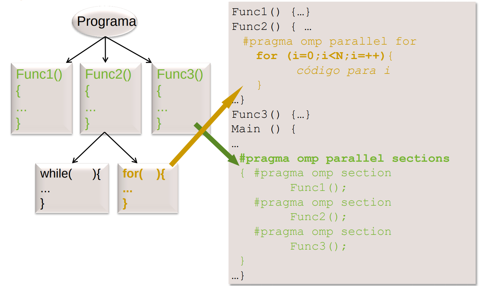

### Unidades de ejecución: instrucciones, hebras y procesos

El hardware se encarga de gestionar la ejecución de las instrucciones. A nivel superior, el SO se encarga de gestionar la ejecución de unidades de mayor granularidad, **procesos** y **hebras**.

* Cada proceso en ejecución tiene su propia asignación de memoria.
* Los SO multihebra permiten que un proceso se componga entre una o varias hebras (hilos).

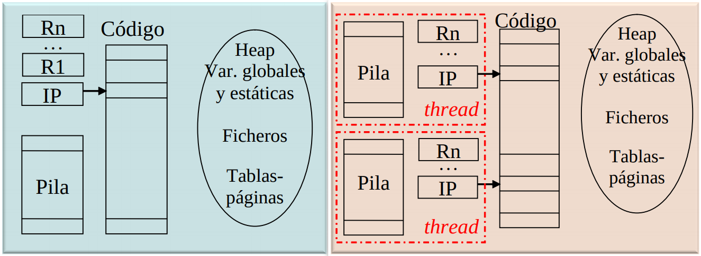

> A la izquierda, modelo de procesos; a la derecha, modelo procesos-hebras.

- Proceso puede tener uno o varios threads.
- **Proceso:** comprende el código del programa (direcciones donde está el código) y todo lo que hace falta para su ejecución (direcciones donde se almacena el contenido si deja de ejecutarse, etc.).
  - Datos en pila (marcos de función, variables locales), segmentos (variables globales --a continuación del código-- y estáticas) y en heap (variables dinámicas).
  - Contenido de los registros.
  - Tabla de páginas.
  - Tabla de ficheros abiertos.
- El SO debe de realizar funciones para reservar y eliminar espacio para el proceso: llamadas al sistema, que requieren un tiempo.
- **Thread:** pertenecen a un proceso, lo que tiene un thread propio es:
  - Su propia pila.
  - Espacio para almacenar los registros del núcleo de procesamiento (SP, puntero de instrucción IP) cuando el thread se suspende para dar paso a la ejecución de otros threads o procesos.
  - Pueden compartir más o menos cosas (asignatura SO). Por lo general, comparte el código, las variables globales y otros recursos (como por ejemplo archivos abiertos) con las hebras del mismo proceso.
- La comunicación entre threads es mas rápida (se usa la memoria que comparten), y crear y eliminar un thread es más rápido.
- Si uso threads para programar en paralelo la granularidad es menor que la granularidad con procesos: la paralelización es para reducir tiempo de ejecución. A este tiempo de ejecución tengo que añadirle un coste de sobrecarga (consecuencia de creación, comunicación y destrucción de procesos o threads), este coste es menor con threads (el tamaño de flujo de instrucciones a paralelizar es menor). Es decir, puedo paralelizar trozos más pequeños en threads, y la paralelización sería más "rentable".


### Relación entre paralelismo implícito, explícito y arquitecturas paralelas

El paralelismo implícito en el código de una aplicación se puede hacer _explícito_ a nivel de instrucciones, a nivel de hebras o a nivel de procesos.

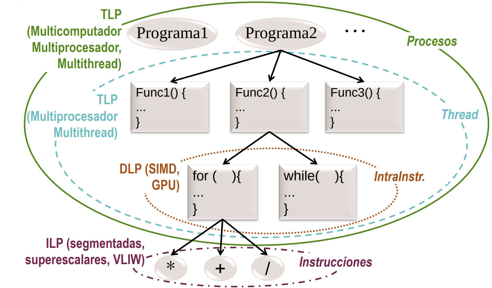

> Se relacionan los distintos niveles en los que se encuentra el paralelismo implícito en el código, con los niveles en los que se puede hacer explícito y con arquitecturas paralelas que aprovechan el paralelismo.
>
> Cada nivel de paralelismo se puede extraer a los sucesivos (dependiendo de qué utilidades, programas, etc. se usen).

* El paralelismo entre programas se utiliza a nivel de procesos. En el momento en el que se ejecuta un programa, se crea el proceso asociado al programa.
* El paralelismo disponible entre funciones se puede extraer para utilizarlo a nivel de procesos o hebras.
* Se puede aumentar la granularidad asociando un mayor número de iteraciones del ciclo a cada unidad a ejecutar en paralelo.
* El paralelismo dentro de un bucle se puede también hacer explícito dentro de una instrucción vectorial para que sea aprovechado por arquitecturas SIMD o vectoriales.
* El paralelismo entre operaciones se puede aprovechar en arquitecturas con paralelismo a nivel de instrucción (ILP) ejecutando en paralelo las instrucciones asociadas a estas operaciones independientes.

### Detección, utilización, implementación y extracción del paralelismo

**¿Quién extrae el paralelismo en cada uno de los niveles?**

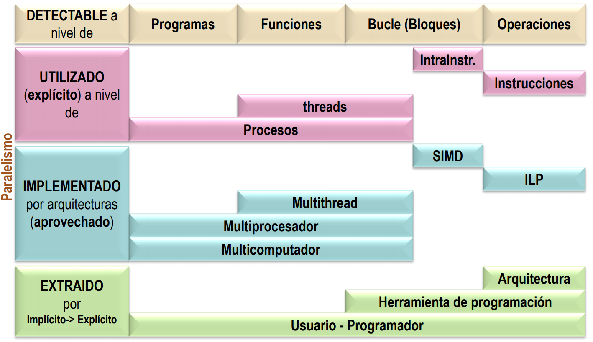

> En esta figura, se relaciona el agente que extrae el paralelismo implícito en los diferentes niveles del código de la aplicación, con los niveles en los que se hace explícito y las arquitecturas que lo aprovechan.
>
> - Utilizado: en qué nivel se hace explícito (se pone de manifiesto) el paralelismo. Ej. en OpenMP se colocan las directivas.
> - Implementado: tipo de arquitecturas paralelas que me aprovechan el paralelismo implícito en los diferentes niveles.
> - Extraído: quién extrae el paralelismo y lo hace explícito al nivel "utilizado" para que puedan aprovecharlo las arquitecturas.
>   - Herramienta de programación: compilador.

* En los procesadores ILP superescalares o segmentados la arquitectura _extrae_ paralelismo. Para ello, eliminan dependencias de datos falsas entre instrucciones y evitan problemas debidos a dependencias de datos, a dependencias de control y a dependencias de recursos. En estos procesadores, la arquitectura extrae el paralelismo _implícito_ en las entradas en tiempo de ejecución (_dinámicamente_). El **grado de paralelismo** de las instrucciones aprovechado se puede incrementar con ayuda del _compilador_ y del _programador_.
* En general, podemos definir el grado de paralelismo de un conjunto de entradas a un sistema, como el máximo número de entradas del conjunto que se pueden ejecutar en paralelo. Para los procesadores, las entradas son instrucciones.

* En las arquitecturas ILP VLIW el paralelismo que se va a aprovechar está ya _explícito_ en las entradas. Las instrucciones que se van a ejecutar en paralelo se captan juntas de memoria. El análisis de dependencias entre instrucciones es en este caso _estático_. El _compilador_ es el principal responsable de extraer paralelismo para arquitecturas VLIW; la ayuda del programador puede incrementar el grado de concurrencia entre instrucciones aprovechado finalmente por la arquitectura.
* Hay compiladores que extraen el paralelismo de datos implícito a nivel de bucle. Algunos compiladores lo hacen explícito a nivel de hebra, y otros dentro de una instrucción para que se pueda aprovechar en arquitecturas SIMD o vectoriales.
* Aún es difícil para un compilador extraer (localizar) paralelismo a nivel de función sin ayuda del programador. El usuario, como programador, puede extraer el paralelismo implícito en un bucle o entre funciones definiendo hebras y/o procesos. La distribución de las tareas independientesentre hebras o entre procesos dependerán:
  * de la granularidad de las unidades de código independientes,
  * de la posibilidad que ofrezca la herramienta para programación paralela disponible de definir hebras o procesos,
  * de la arquitectura disponible para aprovechar el paralelismo (multihebra, multiprocesador, multicomputador), y
  * del sistema operativo disponible.
* Por último, los usuarios del sistema al ejecutar programas están creando procesos que se pueden ejecutar en el sistema o bien concurrentemente, o bien en paralelo, si se dispone de un computador paralelo.

## Lección 2. Clasificación de arquitecturas paralelas

### Computación paralela y computación distribuida

* **Computación paralela:** estudia los aspectos hardware y software relacionados con el desarrollo y ejecución de aplicaciones en un sistema de cómputo compuesto por _múltiples cores/procesadores/computadores_ que es visto externamente como una _unidad autónoma_ (multicores, multiprocesadores, multicomputadores, cluster).
* **Computación distribuida:** estudia los aspectos hardware y software relacionados con el desarrollo y ejecución de aplicaciones en un _sistema distribuido_, es decir, en una _colección de recursos autónomos_ (PC, servidores --de datos, software, ...--, supercomputadores...) situados en _distintas localizaciones físicas_.

### Computación distribuida a gran escala

#### Computación _grid_

* **Computación distribuida a baja escala:** estudia los aspectos relacionados con el desarrollo y ejecución de aplicaciones en una colección de recursos autónomos de un _dominio administrativo_ situados en _distintas localizaciones físicas_ conectados a través de una _infraestructura de red local_.
* **Computación grid:** estudia los aspectos relacionados con el desarrollo y ejecución de aplicaciones en una colección de recursos autónomos de _múltiples dominios administrativos geográficamente distribuidos_ conectados con _infraestructura de telecomunicaciones_.

#### Computación nube o _cloud_

* **Computación _cloud_:** comprende los aspectos relacionados con el desarrollo y ejecución de aplicaciones en un _sistema cloud_.
* **Sistema _cloud_:** ofrece _servicios_ de _infraestructura, plataforma y/o software_, por los que se paga cuando se necesitan (_pay-per-use_) y a los que se accede típicamente a través de una _interfaz (web) de auto-servicio_. Consta de _recursos virtuales_ que
  * son una _abstracción_ de recursos físicos.
  * parecen _ilimitados_ en _número y capacidad_ y son reclutados/liberados de forma _inmediata_ sin interacción con el proveedor.
  * soportan el acceso de múltiples clientes (_multi-tenant_).
  * están conectados con _métodos estándar independientes de la plataforma de acceso_.

### Clasificaciones de arquitecturas y sistemas paralelos

###### Criterios de clasificación de computadores

1. Comercial

   * Segmento del mercado
     - embedidos, servidores de gama baja...

2. Educación, investigación (también usados por fabricantes y vendedores)

   a. Flujos de control y flujos de datos: clasificación de Flynn (1972)

   b. Sistema de memoria

   c. Flujos de control (propuesta de clasificación de arquitecturas con múltiples flujos de control)

   d. Nivel del paralelismo aprovechado (propuesta de clasificación)

### 1. Segmento del mercado

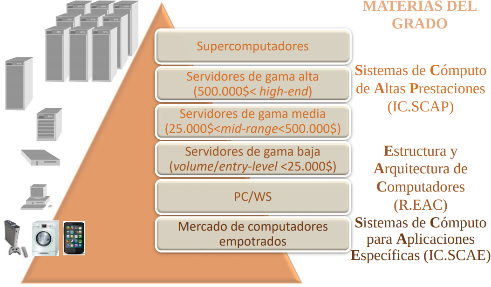

> Abajo, mayor segmento de mercado.

#### Clasificación de computadores según segmento

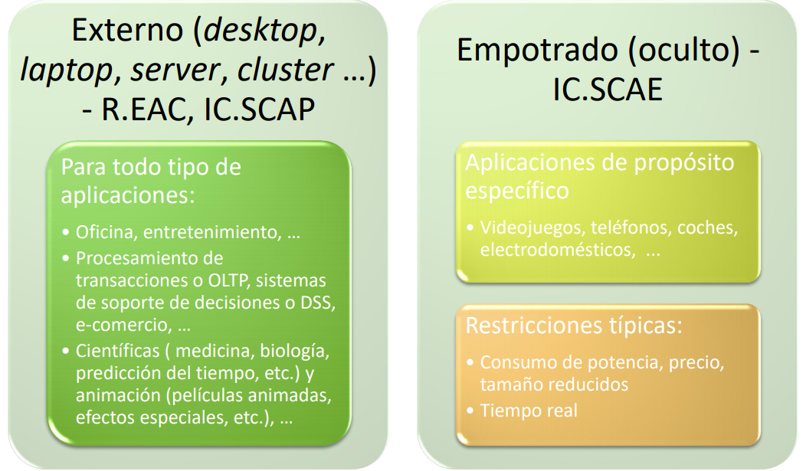

#### Clasificación de componentes (externos) según el segmento del mercado

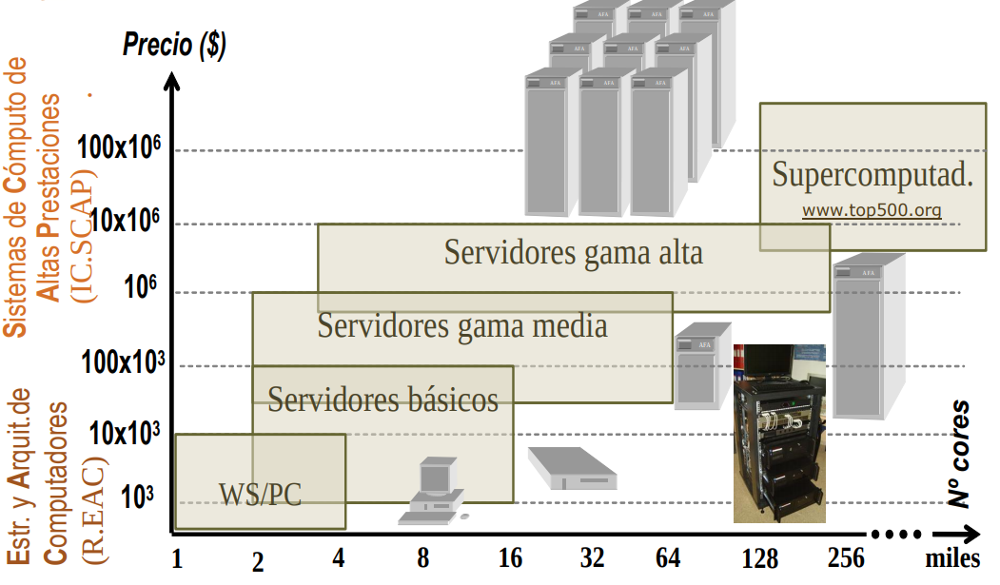

### 2a. Clasificación de Flynn de arquitecturas

La taxonomía de Flynn divide el universo de los computadores en cuatro clases que surgen al considerar que en un computador se procesa una o varias secuencias o flujos de instrucciones, que actúan sobre una o varias secuencias de flujos de datos.

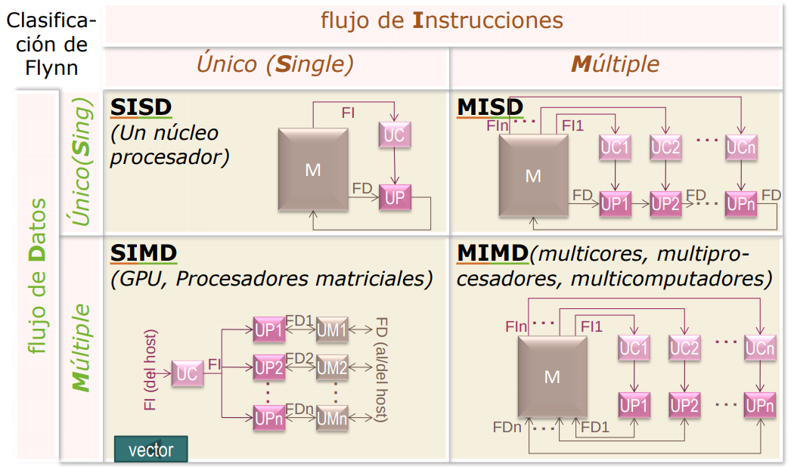

* **Computadores SISD:** un único flujo de instrucciones procesa operandos y genera resultados, definiendo un único flujo de datos.
  * Existe una única UC (unidad de control) que recibe instrucciones de memoria, las decodifica y genera los códigos que definen la operación correspondiente a cada una instrucción que debe realizar la UP (unidad de procesamiento) de datos.El flujo de datos se establece a partir de los operandos necesarios para realizar la operación codificada en cada instrucción, que se traen desde memoria, y de los resultados generados por las instrucciones que se almacenan en memoria.
* **Computadores SIMD:** un único flujo de instrucciones procesa operandos y genera resultados, definiendo múltiples flujos de datos, dado que cada instrucción codifica realmente varias operaciones iguales, cada una actuando sobre operadores distintos. Aprovecha paralelismo de datos.
  * Los códigos que genera la única UC del computador a partir de cada instrucción actúan sobre varias unidades de procesamiento distintas (UPi). De esta forma, un SIMD puede realizar varias operaciones similares simultáneas con operandos distintos. Cada una de las secuancias de operandos y resultados utlizados por las distintas unidades de proceso define un flujo de datos diferente.
* **Computadores MIMD:** el computador ejecuta varias secuencias o flujos distintos de instrucciones, y cada uno de ellos procesa operandos y genera resultados definiendo un único flujo de instrucciones, de modo que existen también varios flujos de datos uno por cada flujo de instrucciones.
  * Existen varias UC que decodifican las instrucciones correspondientes a distintos programas. Cada uno de estos programas procesa conjuntos de datos diferentes, que definen distintos flujos de datos.
* **Computadores MISD:** se ejecutan varios flujos distintos de instrucciones, aunque todos actúan sobre el mismo flujo de datos.
  * Constituyen una clase de computadores cuyo comportamiento se puede implementar con iguales prestaciones en un MIMD en el que sus procesadores se sincronizan para que los datos vayan pasando de un procesador a otro.

Podemos identificar:

* Computadores SISD: monoprocesador.
* Computadores SIMD: procesadores matriciales y procesadores vectoriales.
* Computadores MIMD: multinúcleos, multiprocesadores y multicomputadores.
* Computadores MISD: no existen MISD específicos.

La taxonomía de Flynn no aprovecha el paralelismo entre instrucciones (ILP).

#### Arquitecturas SISD

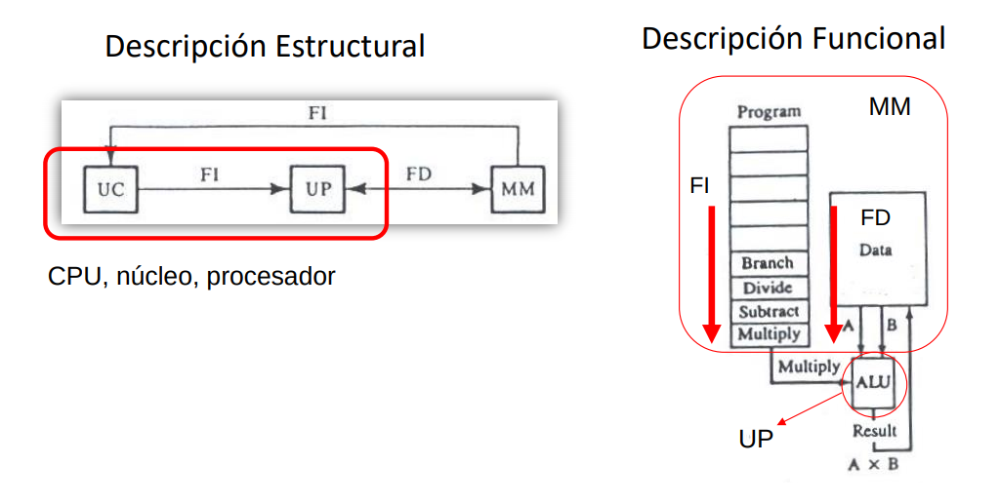

###### Ejemplo

~~~
for i:=1 to 4 do
begin
	C[i] := A[i]+B[i];
	F[i] := D[i]+E[i];
	G[i] := K[i]*H[i];
end;
~~~

Esta ejecución conllevaría 12 intervalos de tiempo.

#### Arquitecturas SIMD

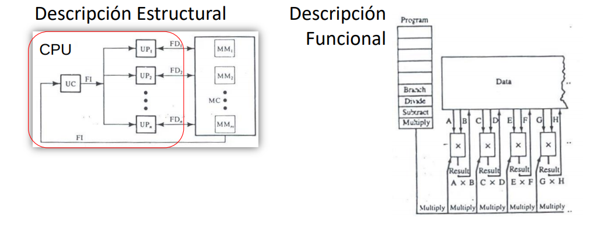

* Aprovechan **paralelismo de datos**.

###### Ejemplo

**Procesadores matriciales**

~~~
for all UPi(i:=1 to 4) do
begin
	C[i] := A[i]+B[i];
	F[i] := D[i]+E[i];
	G[i] := K[i]*H[i];
end;
~~~

**Procesadores vectoriales**

~~~
ADDV C,A,B
SUBV F,D,E
MULV G,K,H
~~~

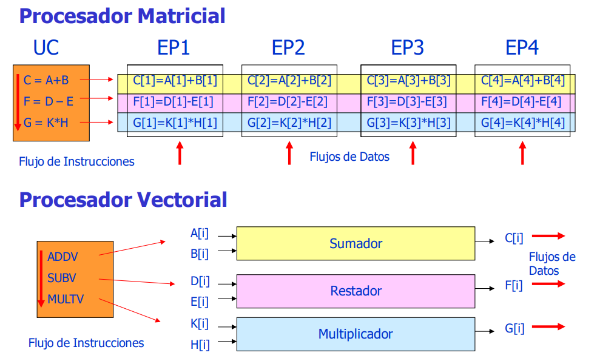

#### Arquitecturas MIMD

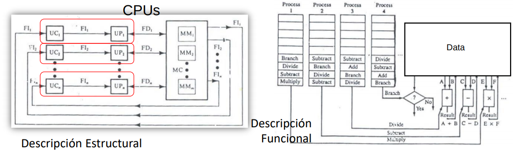

* Aprovechan **paralelismo funcional**.

###### Ejemplo

~~~
for i:=1 to 4 do			for i:=1 to 4 do			for i:=1 to 4 do
begin						begin						begin
	C[i] := A[i]+B[i];			F[i] := D[i]+E[i];			G[i] := K[i]*H[i];
end;						end;						end;

# Proc 1					# Proc 2					# Proc 3
~~~

#### Arquitecturas MISD


* No existen computadores que funcionen según este modelo.
* Se puede simular en un código este modelo para aplicaciones que procesan una secuencia o flujo de datos.

### 2b. Sistema de memoria

* **Sistemas con memoria compartida (SM) o multiprocesadores:** son sisteams en los que todos los procesadores comparten el mismo espacio de direcciones. El programador no necesita conocer dónde están almacenados los datos.
  * Es inmediato implementar una estructura física para multiprocesadores en la que los módulos de memoria se encuentren ubicados en la misma zona del sistema, separados de los procesadores por una **red de interconexión** que arbitre el acceso a estos módulos. También podemos encontrarnos centralizados los dipositivos de E/S.
* **Sistemas con memoria distribuida (DM) o multicomputadores:** son sistemas en los que cada procesador tiene su propio espacio de direcciones particular. El programador necesita conocer dónde están almacenados los datos.
  * Es por tanto lógico que en su estructura física, cerca de cada procesador haya un módulo de memria local, en el que se encuentre su espacio de direcciones. También nos podemos encontrar distribuido el sistema de E/S.

#### Comparativa SMP y multicomputadores

Un **SMP, _Symmetric Multi-Processor_** es una estructura en la que el tiempo de acceso de los procesadores a memoria (también puede extenderse a E/S) será igual sea cual sea la posición de memoria a la que se acceden, es una estructura simétrica. En ellos, el acceso de los procesadores a memoria se realiza a través de una **red de interconexión**.

En multicomputadores, cada procesador tiene su propio módulo de memoria local al que se puede acceder directamente. En esta configuración, la red de interconexión se utiliza para la transferencia de datos compartidos (mensajes) entre nodos de la red. El tamaño de estos mensajes depende del programador.

En multiprocesadores, el tamaño de las transferencias con memoria depende del hardware, y será menor que el de las transferencias entre nodos en un multicomputador.

| Multiprocesador con memoria centralizada (SMP, _Symmetric Multi-Processor_) | Multicomputador                                              |
| ------------------------------------------------------------ | ------------------------------------------------------------ |
| 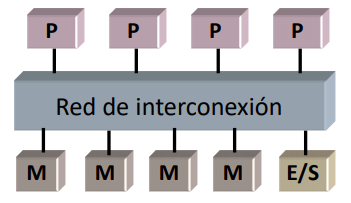                           | 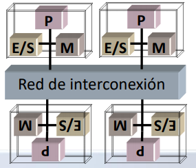                           |
| Mayor _latencia_ · Poco escalable.<br />_Comunicación_ mediante variables compartidas. Datos no duplicados en memoria principal.<br />Se necesita implementar técnicas de _sincronización_.<br />No se necesita distribuir código y datos.<br />La _programación_, generalmente, es más sencilla. | Menor _latencia_ · Escalable.<br />_Comunicación_ mediante paso de mensajes. Datos duplicados en memoria principal, copia datos.<br />_Sincronización_ mediante los mecanismos de comunicación.<br />Hay que distribuir código y datos (carga de trabajo) entre procesadores.<br />La _programación_, generalmente, es más difícil. |

> Estructura típica para un multicomputador (la memoria asignada a un procesador se encuentra ubicada cerca del procesador) y la primera estructura que se utilizó para multiprocesadores (toda la memoria se encuentra situada a igual distancia de todos los procesadores y físicamente centralizada).

* **Latencia en el acceso a memoria:** tiempo de acceso a memoria mayor en multiprocesadores que en multicomputadores debido a: la no localidad de los módulos de memoria, la necesidad de acceder a la memoria atravesando la red de interconexión y al incremento en la latencia media debido a conflictos en la red entre accesos de diferentes procesadores. Además, si varios procesadoresen un momento dado necesitan usar el mismo recurso de red, uno deberá de esperar a que otro deje libre el recurso, suponiendo una penalización en la latencia de memoria para el procesador que espera (de hecho, con más procesadores aumenta la probabilidad de conflicto, esto no ocurre en multicomputadores: es lo que lo hace menos escalable).
* **Mecanismos de comunicación:** en un sistema de múltiples procesadores, éstos pueden cooperar en la ejecución de una aplicación, por ejemplo produciendo uno un dato que necesite otro. _Ver "Comunicación uno-a-uno"._
* **Mecanismos de sincronización:** los diferentes procesadores que ejecutan una aplicación pueden requerir sincronizarse en algún momento (ejemplo: si el procesador A utiliza un dato que produce el procesador B, A deberá esperar a que B lo genere, ver imagen siguiente). En multiprocesadores se aprovechan los mecanismos de comunicación para implementar la sincronización. Basta una función de recepción bloqueante, es decir, que deja al proceso que la ejecuta detenido hasta recibir el dato. En multiprocesadores se utilizan implementaciones software (cerrojos, semáforos, regiones críticas condicionales, monitores u otras estructuras que permiten implementar exclusión mutua), éstos proporcionan soporte en hardware para incrementar las prestaciones en la implementación de primitivas software de sincronización.
* **Herramientas de programación:** en el caso de un multicomputador, antes de ejecutar una aplicación hay que ubicar en la memoria local de cada procesador el código que va a ejecutar y los datos que este código utiliza, es decir, hay que distribuir la carga de trabajo entre los procesadores. En multiprocesadores esta distribución no es necesaria, pues todos los procesadores pueden acceder a cualquiera de los módulos de memoria del sistema. Para obtener buenas prestaciones la distribución debe ser equilibrada, algo que es complicado de calcular _a priori_, en gran medida se deja esta carga para el programador, pues los compiladores no son del todo eficientes en esta tarea. Por tanto, los compiladores y, en general, las herramientas de programación para multicomputadores, deberían ser más sofisticados que para multiprocesadores.
* **Programación:** es más sencilla en un multiprocesador, ya que el programador no debe pensar en copiar datos entre nodos, ni tampoco en la asignación de trabajo (código y datos) a los procesadores. No obstante, los mecanismos de sincronización de los multiprocesadores pueden generar situaciones de error en tiempo de ejecución (pues en multiprocesadores la programación es más sencilla en casos en los que los esquemas de comunicación sean complejos o varíen dinámicamente) que son difíciles de descubrir: es más fácil de entender la sincronización en multicomputadores.

#### Comunicación uno-a-uno

##### En multiprocesador

Ya que los procesadores comparten el espacio de direcciones, pueden acceder a contenidos de direcciones de memoria que otros han producido. De este modo, la comunicación se realiza implícitamente con instrucciones de carga (_load_) y almacenamiento (_store_) del procesador. Se debe garantizar que el flujo de control consumidor del dato lea la variable compartida cuando el productor haya escrito en la variable dato.

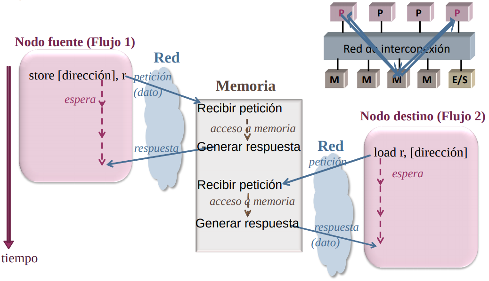

> Transferencia de datos en un procesador. El proceso que ejecuta la instrucción de carga espera hasta recibir el contenido de la dirección. El proceso que ejecuta la instrucción de almacenamiento puede esperar a que termine para garantizar que se mantiene un orden en los accesos a memoria. Obsérvese que para que la transferencia de datos se realice de forma efectiva habría que sincronizar los procesos fuente y destino.

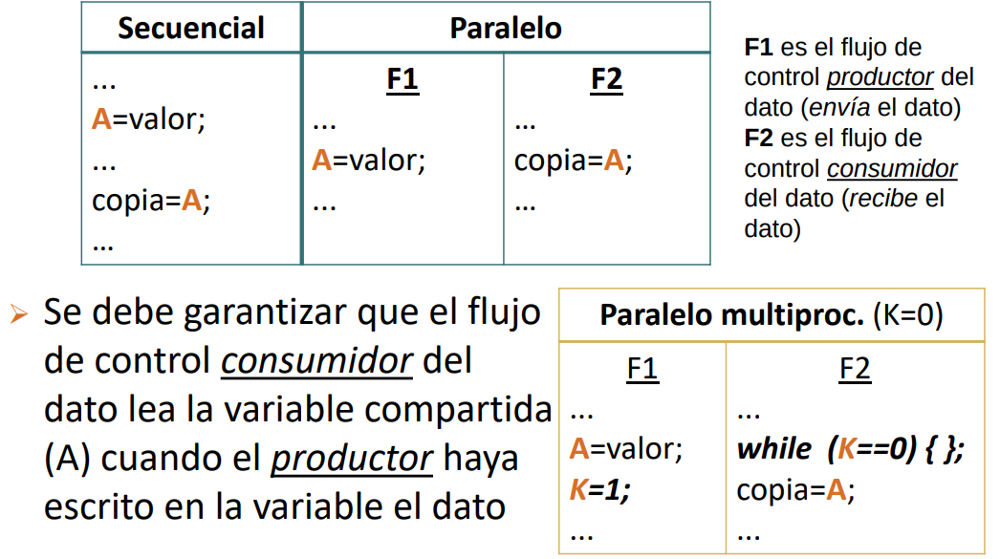

##### En multicomputador

Un procesador no puede acceder al módulo de memoria local de otro procesador mediante un aceso a memoria de carga o almacenamiento. Se necesita implementar un mecanismo software que permita copiar datos entre módulos de memoria de diferentes procesadores a través de la red de interconexión. En este caso, el mismo dato quedará duplicado en el sistema tras la transferencia. Básicamente, para realizar esta copia se pueden utilizar dos funciones: una que permita enviar a un destino un dato (_send_) y otra que permita recibir de una fuente un dato (_receive_). En un multicomputador hay soporte en la red de interconexión y en la interfaz de red para implementar al menos primitivas que permitan una comunicación básica uno-a-uno. Así pues, en un multicomputador hay que implementar mecanismos explícitos en software para poder comunicar. Además esta comunicación es menos eficiente que en un multiprocesador, al tener que copiar datos.

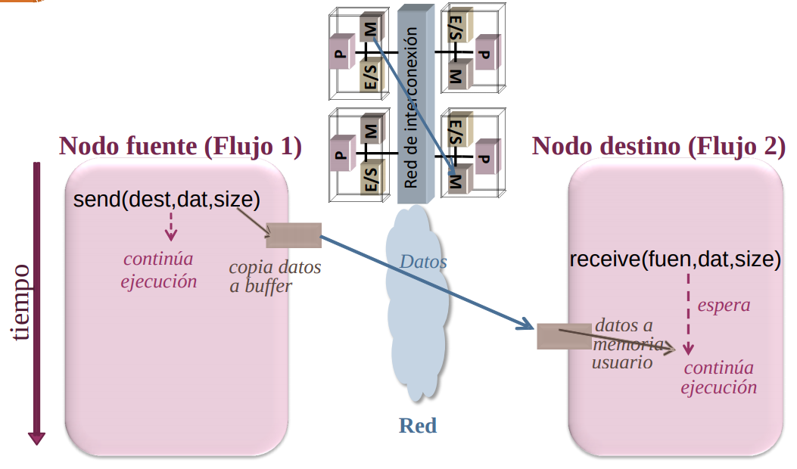

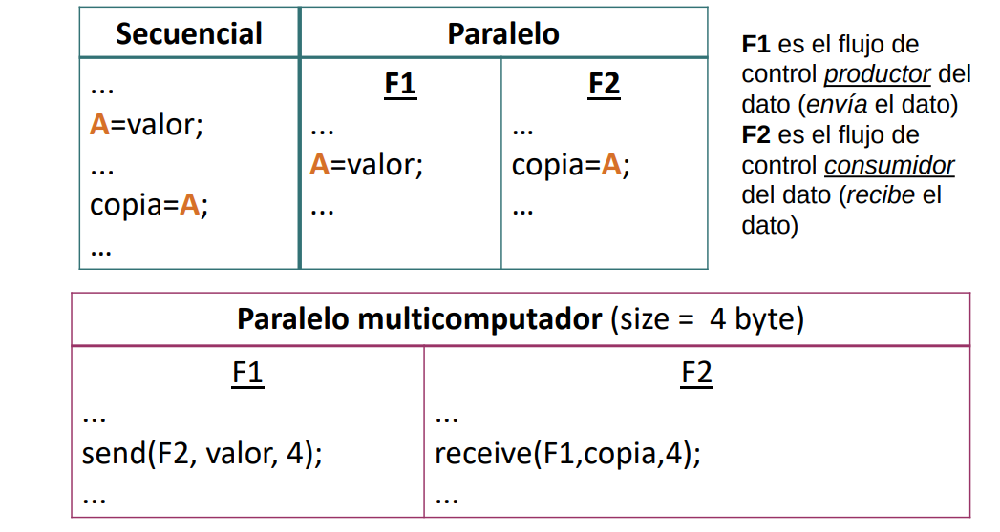

#### Incremento de escalabilidad en multiprocesadores y red de conexión

Como los SMP tienen escasa escalabilidad, se ha intentado incrementar la escalabilidad en multiprocesadores:

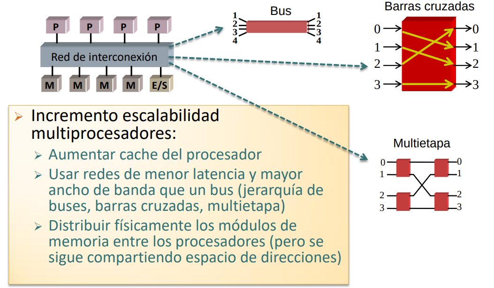

#### Clasificación completa de computadores según el sistema de memoria

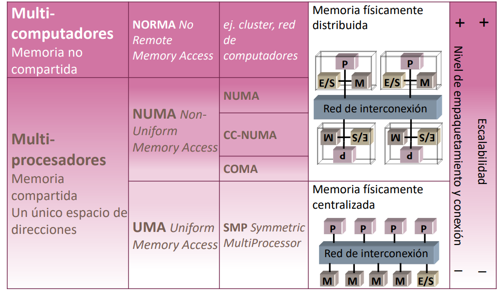

En función de la uniformidad de acceso a memoria podemos clasificar los procesadores en:

* **Multiprocesadores con acceso a memoria uniforme o UMA:** el tiempo de acceso de los procesadores a una determinada zona de memoria es igual sea cual sea el procesador. Igualmente, el acceso a una posición de memoria en caché es igual para todos los procesadores.
* **Multiprocesadores con acceso a memoria no uniforme o NUMA:** el tiempo de acceso a una posición de memoria depende del procesador, ya que un procesador tardará menos tiempo en acceder al bloque de memoria local que el situado junto a otro procesador.
  * **NCC-NUMA (_Non-Cache-Coherent Non-Uniform Memory Access_):** no incorporan hardware para evitar problemas por incoherencias entre cachés de distintos nodos. Esto hace que los datos modificables compartidos no se puedan trasladar a cachñe de nodos remotos; hay que acceder a ellos individualmente a través de la red. Se puede hacer más tolerable la latencia utilizando precaptación (_prefetching_) de memoria y procesamiento multihebra.
  * **CC-NUMA (_Cache-Coherent Non-Uniform Memory Access_):** tienen hardware para mantener coherencia entre cachés de distintos nodos, que se encarga de las transferencias de datos compartidos entre nodos. Éste supone un coste añadido e introducen un retardo que hace que estos sistemas escalen en menor grado que un NUMA.
  * **COMA (_Cache Only Memory Access_):** la memoria local de los procesadores se gestiona como caché. El sistema de mantenimiento de coherencia se encargan de llevar dinámicamente (en tiempo de ejecución) el código y los datos a los nodos donde se necesiten. Tiene mayor coste y retardo que CC-NUMA, por lo que no existe actualmente ningún sistema comercial COMA.

#### Red en sistemas con memoria físicamente distribuida (NI: _Network Interface_)

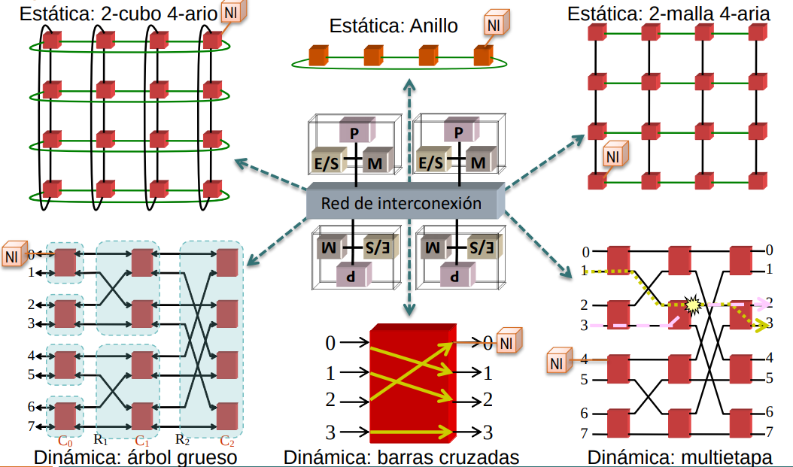

###### Ejemplos

**Red (con conmutador o _switch_) de barras cruzadas**

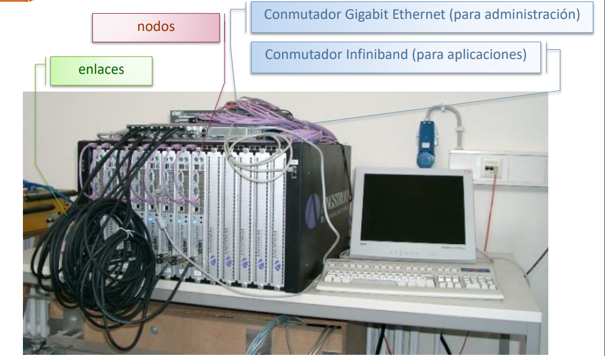

**Placa CC-NUMA con red estática**

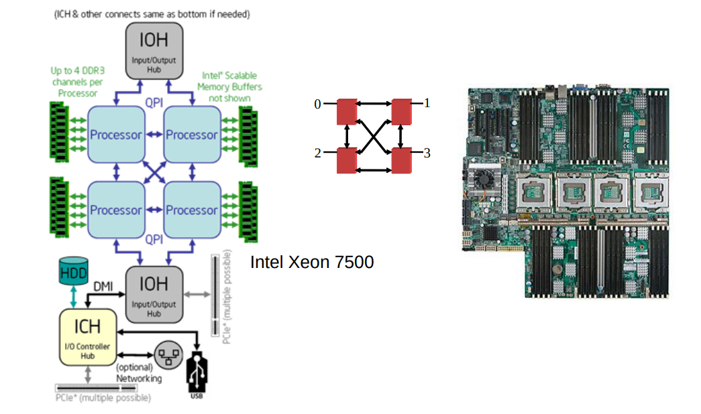

### 2c. Flujos de control

#### Propuesta de clasificación de computadores con múltiples flujos de control o _threads_

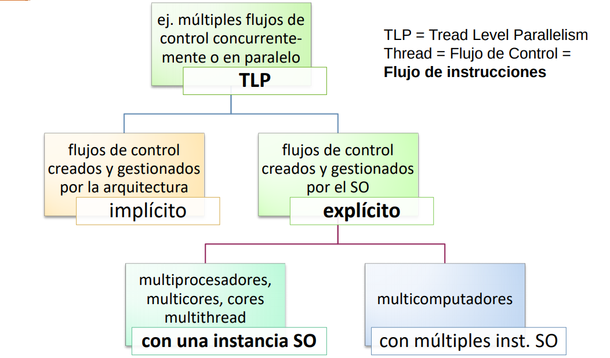

### 2d. Nivel de paralelismo aprovechado

#### Arquitecturas con DLP, ILP y TLP

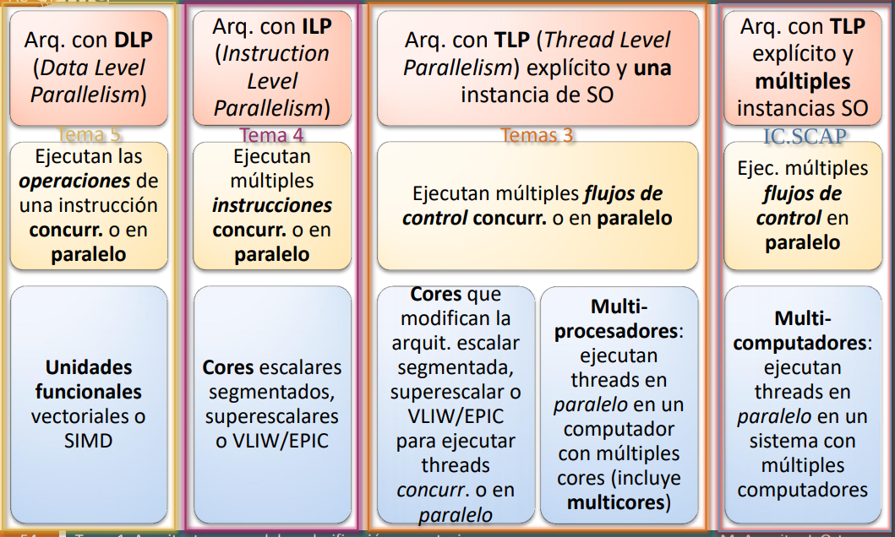

> Thread = flujo de control o de instrucciones.

### Nota histórica

* **DLP, _Data Level Parallelism_**
  * Unidades funcionales (o de ejecución) SIMD (o multimedia).
* **ILP, _Instruction Level Parallelism_**
  * Procesadores/cores segmentados.
  * Procesadores con múltiples unidades funcionales.
  * Procesadores/cores superescalares.
  * Procesadores/cores VLIW.
* **TLP, _Thread Level Parallelism_**
  * TLP explícito con una instancia de SO
    * Multithread grano fino (FGMT).
    * Multithread grano grueso (CGMT).
    * Multithread simultánea (SMT).
    * Multiprocesadores en un chip (CMP) o multicores.
    * Multiprocesadores.
  * TLP explícito con múltiples instancias del SO (multicomputadores).


## Lección 3. Evaluación de prestaciones

### Medidas usuales para evaluar prestaciones

#### Tiempo de respuesta

**Tiempo de respuesta:** tiempo transcurrido desde que se lanza la ejecución de un programa y se tienen sus resultados. Incluye:

* **Tiempo de CPU:** tiempo que el procesador dedica a ejecutar instrucciones máquina de su repertorio, tanto:
  * **Tiempo de CPU de usuario:** tiempo en ejecución en espacio de usuario.
  * **TIempo de CPU de sistema:** se corresponde con la actividad que debe llevar a cabo el SO para la ejecución del programa, tiempo en el nivel del kernel del SO.
  * **Tiempo de espera debido a E/S:** tiempo asociado a las esperas debidas a las entradas/salidas.
  * **Tiempo de espera debido a la ejecución de otros programas.**

---

* Real (_wall-clock time, elapsed time, real time_).

* CPU time = user time + system time (no incluye todo el tiempo, consideramos E/S despreciable).

* Con la orden `time` obtenemos información sobre el tiempo de respuesta de un programa:

  * Tiempo de CPU de espacio de usuario (`user`): tiempo en ejecución en espacio de usuario.
  * Tiempo de CPU de sistema (`sys`): tiempo en el nivel del kernel del SO.
  * Tiempo asociado a esperas (`elapsed`) debidas a I/O o asociados a ejecución de otros programas.

  Tenemos que:

  * Con un flujo de control:
    $$
    \text{elapsed}\geq\text{CPU time}
    $$

  * Con múltiples flujos de control:
    $$
    \text{elapsed}<\text{CPU time}, \text{elapsed}\geq\frac{\text{CPU time}}{\text{nº flujos de control}}
    $$


* Hay otras alternativas para obtener tiempos:

  | Función                             | Fuente               | Tipo                  | Resolución aprox. |
  | ----------------------------------- | -------------------- | --------------------- | ----------------- |
  | `time`                              | SO (`/usr/bin/time`) | elapsed, user, system | 10000             |
  | `clock()`                           | SO (`time.h`)        | CPU                   | 10000             |
  | `gettimeofday()`                    | SO (`sys/time.h`)    | elapsed               | 1                 |
  | `clock_gettime()`/`clock_getres()`  | SO (`time.h`)        | elapsed               | 0.001             |
  | `omp_get_wtime()`/`omp_get_wtick()` | OpenMP (`omp.h`)     | elapsed               | 0.001             |
  | `SYSTEM_CLOCK()`                    | Fortran              | elapsed               | 1                 |

### Tiempo de CPU

Considerando despreciable el tiempo de E/S, el tiempo de CPU puede obtenerse mediante:
$$
T_{\text{CPU}}=\text{Ciclos del programa}\times T_{\text{ciclo}}=\frac{\text{Ciclos del programa}}{F}\hspace{1cm}(1)
$$

* Ciclos del programa: número de ciclos de reloj del procesador que tarda en ejecutarse el programa.
* Tiempo de ciclo: tiempo de un ciclo de reloj del procesador.
* F: frecuencia reloj.

Dado que podemos expresar el número de ciclos de acuerdo al número de instrucciones:
$$
T_{\text{CPU}}=\text{NI}\times \text{CPI}\times T_{\text{ciclo}}=\frac{\text{NI}\times \text{CPI}}{F}\hspace{1cm}(2)
$$

* NI: número de instrucciones máquina del repertorio del procesador que se han procesado.
* CPI: número medio de ciclos por instrucción.

Podemos calcular CPI del siguiente modo:
$$
\text{CPI} = \frac{\text{Ciclos del programa}}{\text{NI}}=\frac{\sum_{i=1}^W \text{NI}_i\times \text{CPI}_i}{\text{NI}}\hspace{1cm}(3)
$$

* NI_i: número de instrucciones del tipo i que tiene el programa ejecutado por el procesador.
* CPI_i: número de ciclos del procesador que necesita una instrucción del tipo i para procesarse.
* W: número de tipos de instrucciones diferentes.

En (2), el número de instrucciones a ejecutar, NI, depende del número y tipo de operaciones del problema que implementa el programa ejecutado, del repertorio de instrucciones máquina que se utiliza para codificarlas, y de lo eficiente que sea el compilador para usar las instrucciones máquina disponibles.

* En los **repertorios de instrucciones escalares**, las instrucciones máquina codifican una única operación. Cada operación que implementa el programa se codifica mediante una instrucción.

* Existen arquitecturas aprovechadas para aprovechar el **paralelismo de datos**, en las que se repite la misma operación aunque con operandos diferentes. En estos repertorios el número de instrucciones necesario para codificar los programas es menor que si se usase un repertorio escalar, y se puede estimar a partir del cociente entre el número de operaciones del programa (N_oper) y el número de operaciones que puede codificar cada instrucción (OPI):
  $$
  \text{NI}=\frac{\text{N}_\text{oper}}{\text{OPI}}\hspace{1cm}(4)
  $$


Hay procesadores que pueden lanzar para que empiecen a ejecutarse (emitir) varias instrucciones al mismo tiempo.
$$
\text{CPI}=\frac{\text{CPE}}{\text{IPE}}\hspace{1cm}(5)
$$

* CPE: número mínimo de ciclos transcurridos entre los instantes en el que el procesador puede emitir instrucciones.
* IPE: instrucciones que pueden emitirse cada vez que se produce dicha emisión.

Por ejemplo:

* En un procesador no segmentado, en el que las instrucciones se ejecutan de una a una:
  * CPE = número medo de ciclos de reloj que tarda en procesarse una instrucción (hasta que no termina ésta no empieza la siguiente).
  * IPE = 1.
* En un procesador segmentado,
  * El valor máximo de CPE es 1 dado que cada ciclo podrían empezar a ejecutarse instrucciones. Por tanto, CPI = 1/IPE.
  * Si el procesador segmentado sólo puede empezar a ejecutar una instrucción por ciclo, CPI=1: caso ideal, pues en un procesador segmentado no en todos los ciclos pueden comenzar a ejecutarse instrucciones (debido a dependencias, colisiones, etc.). En general, CPE, CPI > 1.

Cuanto más próximo a 1 sea CPI, más eficientemente se estará utilizando el cauce del procesador.

* En un procesador superescalar o VLIW, se pueden emitir varias instrucciones por ciclo, luego CPI puede ser menor que 1, y tanto menor cuanto más paralelismo ILP aproveche.

El tiempo de ciclo (o frecuencia) depende fundamentalmente de la tecnología de integración utolizada. No obstante, las características de diseño e implementación de la microarquitectura también afectan al tiempo de ciclo al que pueden funcionar los circuitos.

*Por otra parte,*

* *RISC tiene menos instrucciones de CISC.*
* *CISC tienen instrucciones de acceso a memoria de la ALU.*
* *Los RISC para acceder a memoria sólo pueden usar instrucciones dedicadas a memoria.*

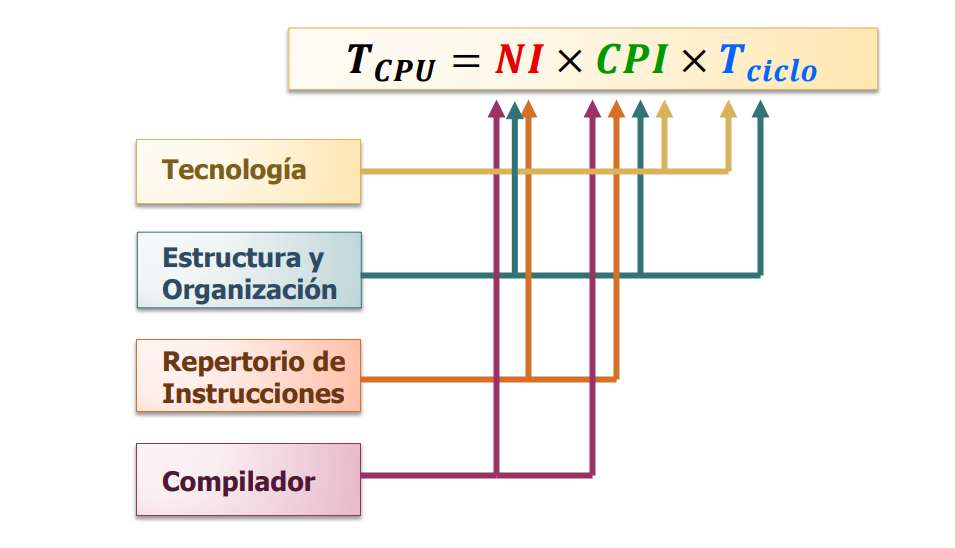

### Productividad. Medidas de velocidad de procesamiento: MIPS, MFLOPS

**MIPS:** Millones de Instrucciones por Segundo
$$
\text{MIPS}=\frac{\text{NI}}{T_\text{CPU}\times10^6}\hspace{1cm}(6)
$$

* Se considera que el tiepo transcurrido es el tiempo de CPU calculado en (1).
* Depende del repertorio de instrucciones (difícil la comparación de máquinas con repertorios distintos).
* Puede variar con el programa (no sirve para caracterizar a la máquina).
* Puede variar inversamente con las prestaciones (mayor valor de MIPS corresponde a peores prestaciones).
* _MIPS as Meaningless Indication of Processor Speed_.

**MFLOPS:** Millons of Floating Point Operations per Second
$$
\text{MFLOPS}=\frac{\text{Nº de operaciones en coma flotante}}{T_\text{CPU}\times10^6}\hspace{1cm}(7)
$$

* No es una medida adecuada para todos los programas (sólo tiene en cuenta las operaciones en coma flotante del programa).
* El conjunto de operaciones en coma flotante no es constante en máquinas diferentes y la potencia de las operaciones en coma flotante no es igual para todas las operaciones (por ejemplo, con diferente precisión, no es igual una suma que una multiplicación..).
* Es necesaria una normalización de las instrucciones en coma flotante

### _Benchmarks_

El **benchmark** es una técnica utilizada para medir el rendimiento de un sistema o componente del mismo. Las medidas de prestaciones que realicemos o que nos ofrezcan terceros deber ser fiables y aceptadas por los interesados:

* Para confiar en las medidas de tiempo de respuesta, productividad y escalabilidad que se dan de un sistema, éstas se deben obtener procesando un conjunto de entradas que sean representativas del funcionamiento habitual del sistema.
* Deben permitir comparar diferentes realizaciones de un sistema o diferentes sistemas (aceptadas por todos los interesados: usuarios, fabricantes, vendedores...)
* Deben de ser fiables: representativos, evaluar diferentes componentes del sistema y reproducibles.

Podemos diferenciar los siguientes tipos:

* **De bajo nivel o microbenchmark:** evalúan las prestaciones de distintos aspetos de la arquitectura o del software (el procesador, la memoria, E/S, comunicación _send/recieve_, mecanismos de sincronización, el SO o las herramientas de programación).
  * Test ping-pong, evaluación de las operaciones con enteros o con flotantes.
* **Kernels:** son trozos de código muy utilizados en diferentes aplicaciones. Junto con los de bajo nivel son útiles para encontrar los puntos fuertes de cada máquina.
  * Resolución de sistemas de ecuaciones, multiplicación de matrices, FFT, descomposición LU.
* **Sintéticos:** también son trozos de código, pero no pretenden obtener un resultado con significado.
  * Dhrystone, Whetstone.
* **Programas reales:** utilizados en el sector de computadores que pretenden evaluar como por ejemplo bases de datos, servidores web...
  * SPEC CPU2017: enteros (gcc, perlbmk).
* **Aplicaciones diseñadas:** se diseñan aplicaciones que pretenden representar aquellas para las que se utiliza el computador.
  * Predicción de tiempo, dinámica de fluidos, animación... (p. ej. SPEC2017).

### Mejora o ganancia de prestaciones

Uno de los cometidos más importantes de la Arquitectura de Computadores consiste en determinar dónde están los cuellos de botella del computador y proporcionar estrategias para evitarlos y mejorar las prestaciones.

Para medir el resultado de una mejora se puede utilizar la ganancia de velocidad, que compara la velocidad de un computador antes y después de mejorar alguno de sus recursos. La expresión correspondiente a la ganancia de velocidad, S_p, es la siguiente:
$$
S_p=\frac{V_p}{V_1}=\frac{(W/T_p)}{(W/T_1)}=\frac{T_1}{T_p}\hspace{1cm}(8)
$$

* V_1: velocidad de ejecución del programa o conjunto de programas antes de aplicar la mejora.
* V_p: velocidad de la mejora.
* W: carga de trabajo.
* T_1: tiempo de procesamiento de la carga de trabajo antes de aplicar la mejora.
* T_p: tiempo de procesamiento de la carga de trabajo tras la mejora.

#### ¿Qué impide que se pueda obtener la ganancia en velocidad pico?

* Riesgos:
  * Datos.
  * Control.
  * Estructurales.
* Accesos a memoria (debido a la jerarquía).

### Ley de Amdahl

Esta ley establace una cota superior a la ganancia de velocidad, S_p, que puede conseguirse al mejorar alguno de los recursos del computador en un factor igual a p, y según la frecuencia con que se utiliza este recurso en la máquina de partida. Ésta establece que:
$$
S_p\leq \frac{1}{1+f\times(p-1)}\hspace{1cm}(9, \text{Ley de Amdahl})
$$

* f es la fracción del tiempo de ejecución antes de aplicar la mejora en un recurso en la que no se utiliza dicho recurso (y, por tanto, la mejora no tendría ningún efecto).

Así:

* Si f = 1 (el recurso mejorado no se utiliza), S_p <= 1 y por tanto no se produciría mejora de velocidad alguna.
* Cuando f -> 0, entonces S_p -> p (alcanza la mayor mejora posible).

###### "Demostración" de la ley de Amdahl

Basta tener en cuenta que en el tiempo de ejecución de la carga de trabajo en el recurso sin mejora, T_1, se puede distinguir una parte, f, donde no se usa el recurso, y otra parte en la que se utiliza:
$$
T_1=f\times T_1+(1-f)\times T_1\hspace{1cm}(10)
$$
Por tanto, el tiempo de ejecución de la carga de trabajo con el recurso mejorado en un factor p, T_p, debe cumplir:
$$
f\times T_1 + \frac{(1-f)}{p}\times T_1 \leq T_p\hspace{1cm}(11)
$$
Dado que la parte de tiempo f\*T_1 donde no se utiliza el recurso mejorado no se reducirá, y la parte (1-f)*T_1 donde se utiliza el recurso podría reducirse como máximo en un factor p.

Sustituyendo (10) y (11) en (8) se obtiene la desigualdad (9).