# Tema 2. Programación paralela

>  Podemos quitar dependencias WAW y WAR mediante variables (hay herramientas que lo hacen).

## Lección 4. Herramientas, estilos y estructuras en programación paralela

### Problemas que plantea la programación paralela

_Podemos aprovechar paralelismo a nivel de bucle y a nivel de función, y podemos hacerlo explícito a nivel de threads o de procesos del SO (entidades que están en ejecución en mi máquina). Los pueden aprovechar los multithread, multiprocesadores y multicomputadores._

_Llamamos flujo de instrucciones a threads y procesos._

Los problemas que abordan la programación paralela y que no se encuentran en secuencial:

* **División en unidades de cómputo independientes:** se han de encontrar qué tareas podemos ejecutar en paralelo, descomponiendo las aplicaciones en tareas que son independientes.
* **Agrupación/asignación de tareas o carga de trabajo (código, datos) en procesos/threads:** agrupamos estas tareas en **flujos de instrucciones** (T0, T1 a FI0; T3, T4 a FI1); para que puedan ejecutarse en paralelo.
* **Asignación a procesadores:** estas tareas las asignamos a núcleos o procesadores diferentes (FI0 a P0, FI1 a P1). Esta asignación podemos dejarla al SO, o podemos hacerla manualmente.

* **Sincronización y comunicación:** las tareas que colaboran en la ejecución de la misma ejecución producen datos que producen otras tareas en un flujo de instrucciones distinto: hay que **comunicar** datos de un flujo de instrucciones a otro.

Sería ideal que la herramienta de programación o el SO se encargase de esto.

### Puntos de partida

¿De qué punto podemos partir para obtener un programa paralelo?

* Directamente desde la **descripción** o definición de la aplicación: creamos modelos paralelizables
* Desde la **versión secuencial**.
  * Ventajas de esto: por la ley de Amdahl, podemos ver qué consume el mayor tiempo en mi aplicación.
  * Desventajas: a veces hay descripciones matemáticas que son más paralelizables que otras. Si partimos ya de un código secuencial que implementa de una determinada descripción, estamos restringidos a éste.

Podemos apoyarnos en:

* Programas paralelos que resuelvan problemas parecidos.
* Bibliotecas que implementan núcleos de código muy usados de forma paralela.

### Modos de programación MIMD

* **Modo SPMD:** todos los códigos que se ejecutan en paralelo se obtienen compilando el mismo programa (cuando paralelizamos una aplicación escribimos un único código que ejecutan todos los procesadores). Cada copia trabaja con un conjunto de datos distintos, y se ejecuta en un procesador diferente. El paralelismo está en que cada instancia del código aplica ese código a datos distintos. Aprovechamos, por tanto, el paralelismo de datos.

  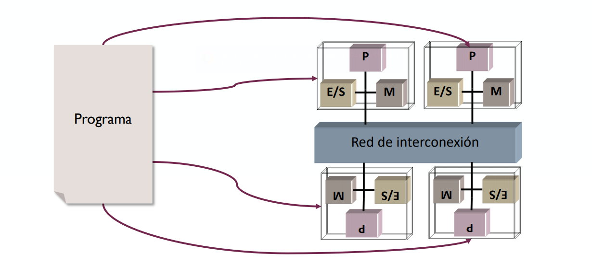

* **Modo MPMD:** los códigos que se ejecutan en paralelo se obtienen compilando programas independientes. En este caso la aplicación a ejecutar se divide en unidades independientes (dividimos el programa en diversos tipos de código). Cada unidad trabaja con un conjunto de datos y se asigna a un procesador distinto. Aprovechamos el paralelismo de tareas.

  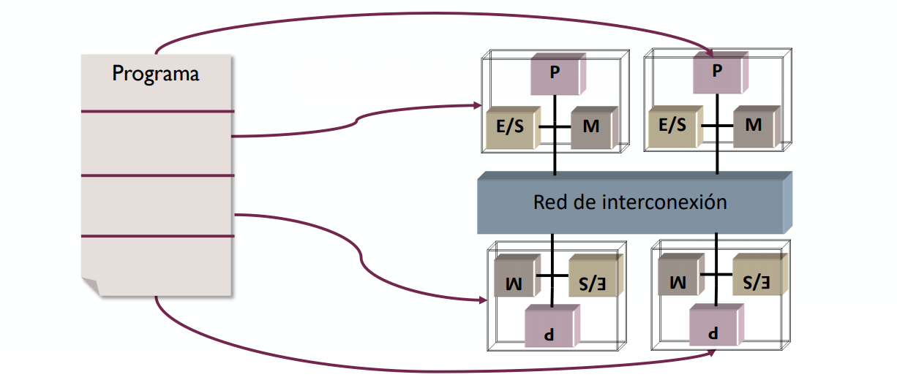

SPMD es recomendable en sistemas masivamente paralelos, ya que es muy difı́cil encontrar cientos de unidades de código diferentes dentro de una aplicación, siendo más fácil escribir un solo programa. En la práctica es el más utilizado en multiprocesadores y multicomputadores.

### Herramientas de programación paralela

Clasificación que usa como criterio el nivel de abstracción que la herramienta sitúa al programador, es decir, el trabajo que tiene que hacer el programador para paralelizar.

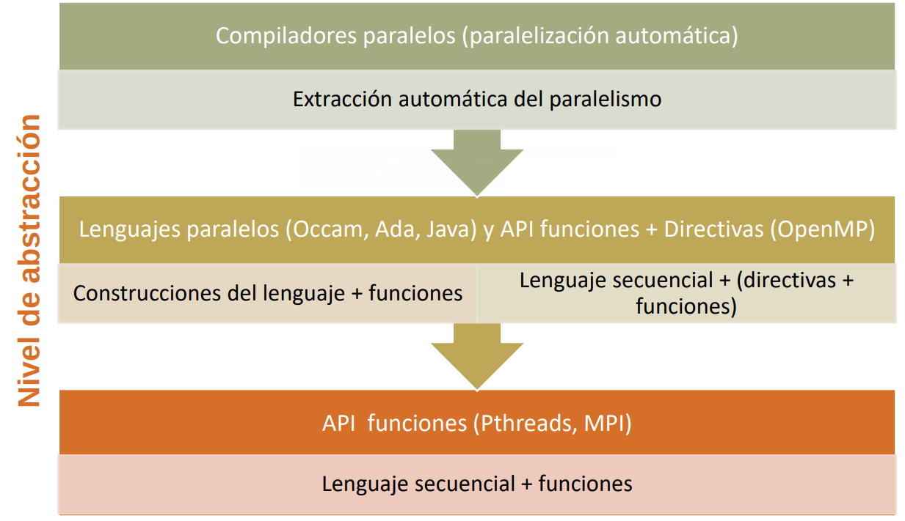

Las herramientas para obtener programas paralelos deben permitir de forma explícita o implícita las siguientes tareas:

- Localizar paralelismo o descomponer en tareas independientes (decomposition).
- Crear y terminar procesos/threads, flujos de instrucciones, (o enrolar y desenrolar en un grupo).
- Distribuir trabajo entre procesos. Asignar las tareas, es decir, la carga de trabajo (código + datos), a procesos/threads (scheduling).
- Comunicar y sincronizar procesos/threads.
- Asignar procesos a procesadores.

De mayor a menor nivel de abstracción:

* **Compiladores paralelos:** paralelizan automáticamente. Se pretende que extraigan automáticamente el paralelismo tanto a nivel de bucle (paralelismo de datos) como a nivel de función (paralelismo de tareas). Para ello, hacen análisis de dependencias entre bloques de código, iteraciones de un bucle o funciones. Detecta dependencias RAW, WAW y WAR. _Ejemplo: compilador de Intel._

  * Debemos darle un código secuencial.
  * La herramienta hace de forma automática.
  * Aún limitados a aplicaciones que exhiben un paralelismo regular, como los cálculos a nivel de bucle.

* **Lenguajes paralelos** _(ej. Occam, Ada, Java)_ / **API funciones + directivas** _(ej. OpenMP)_. Sitúan al programador en un nivel de abstracción superior, facilitando el trabajo de paralelización o ahorrándolo, aunque puede que sólo se aproveche uno de ellos: de datos o de tareas. Facilitan estas tareas mediante:

  * Construcciones propias del lenguaje. Pueden tanto distribuir la carga de trabajo como crear y terminar procesos e incluir sincronización.
  * Directivas del compilador.
  * Funciones de biblioteca. Implementan en paralelo algunas operaciones usuales.

  La ventaja principal de éstos es que son más fáciles de escribir y de entender las bibliotecas de funciones, a la vez que más cortos.

  * Lenguajes paralelos: la sintaxis y las utilidades del propio lenguaje permiten la paralelización.
  * API funciones + directivas: lenguaje secuencial + directivas + funciones, aprovechan el lenguaje secuencial y añaden directivas y funciones.
    * OpenMP: debemos localizar los paralelismos, la herramienta asigna las tareas, crea y termina los threads y comunica y sincroniza los procesos/threads.

* **API funciones (bibliotecas de funciones para programación paralela)**. El programador utiliza lenguaje secuencial y una biblioteca de funciones. El cuerpo de los procesos y hebras se escribe de forma secuencial y el programador se encarga explícitamente de dividir las tareas entre los procesos, crear o destruirlos, implementar comunicación, etc. _(ej. Pthreads, MPI)_. Principales ventajas:

  * Los programadores no tienen que aprender un nuevo lenguaje.
  * Las bibliotecas están disponibles para todos los sistemas paralelos.
  * Las bibliotecas están más cercanas al hardware y proporcionan al programador un control a más bajo nivel.
  * Se pueden utilizar a la vez bibliotecas para programar con hebras y para programar con procesos.

  Por otro lado,

  * No tienen directivas, hay que hacer un trabajo mayor.

### Herramientas para obtener programas paralelos

Las tareas puede que la haga la herramienta o no, de todos modos deben facilitarnos formas de programar en paralelo: dependiendo del nivel de abstracción especificado arriba el programador deberá hacer más o menos.

Las herramientas permiten de forma implícita o explícita:

* **Localizar** paralelismo o descomponer en tareas independientes (_decomposition_).
* **Asignar** las tareas, es decir, la carga de trabajo (código + datos), a procesos/threads (_scheduling_).
* **Crear y terminar** procesos/threads (o enrolar y desenrolar en un grupo).
* **Comunicar y sincronizar** procesos/threads.

El programador, la herramienta o el SO se encarga de asignar procesos/threads a unidades de procesamiento (_mapping_).

###### Ejemplo: cálculo de PI con OpenMP/C

> Con `parallel` le indicamos a OpenMP que haga lo necesario para crear los threads, procesar en paralelo y matar a los threads que ha creado. En este caso hace tres threads (el thread padre también hace trabajo).
>
> Le añadimos la directiva `for` para decirle a OpenMP que las iteraciones pueden ejecutarse en paralelo, y que reparta las iteraciones entre los threads; si no lo añadiésemos cada thread haría todas las iteraciones.
>
> Con respecto a la comunicación, los resultados de cada thread que calcularán en cada iteración hay que sumarlas todas ellas. Para indicar a OpenMP que deben de sumarse, le indicamos que se comuniquen en la cláusula `reduction`: le decimos que reduzca la variable `sum` a una variable compartida, es decir, que todas las sumas se hacen sobre la misma variable.
>
> La asignación a procesadores la dejamos al SO.

> En el caso de MPI debemos de asignar las iteraciones del bucle a procesos. Es un SPMD: usa el mismo código. Hemos tenido que modificar el ciclo `for` para repartir los procesos: hacemos nosotros el reparto. También usamos una reducción como en el caso de OpenMP. Por tanto, se trata de un nivel de abstracción menor.
>
> `MPI_Reduce` implementa la comunicación colectiva.

### Comunicaciones colectivas

Una comunicación colectiva es una comunicación en la que intervienen múltiples flujos de instrucciones: todos los que están colaborando en la ejecución paralela de la aplicación.

Las herramientas nos ofrecen la posibilidad de comunicar más cosas, que no tengamos que implementarlo todo en base a comunicación **uno-a-uno**. Estas herramientas nos ofrecen los siguientes patrones de comunicación:

_**Barrera:** punto en el código en el que todos los threads se esperan entre sí para continuar (bloque práctico 1). Pueden implementarse mediante cerrojos o a nivel software._

#### Comunicación uno-a-todos

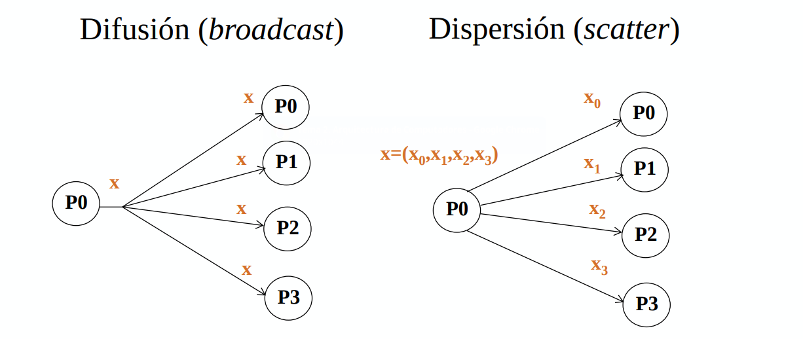

> _P_ de procesador, se refiere a flujo de instrucciones. Uno envía y otros reciben.

Un proceso envía y todos los procesos reciben. Dos variantes:

* **Difusión:** todos los procesos reciben el mismo mensaje.
* **Dispersión:** cada proceso receptor recibe un mensaje diferente (el reparto se suele ordenar de acuerdo al identificador de proceso).

#### Comunicación todos-a-uno

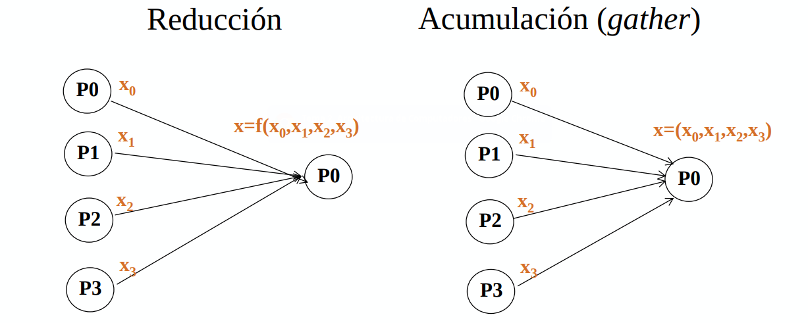

En este caso todos los procesos envían un mensaje a un único proceso.

* **Reducción:** los mensajes enviados por los procesos se combinan en un solo mensaje mediante algún operador, o mediante el resultado de una $f$ operación conmutativa y asociativa.
* **Acumulación:** es la operación inversa a la reducción. Los mensajes se reciben de forma concatenada en el receptor. El orden en la que se concatenan depende generalmente del identificador del proceso.

#### Comunicación múltiple uno-a-uno

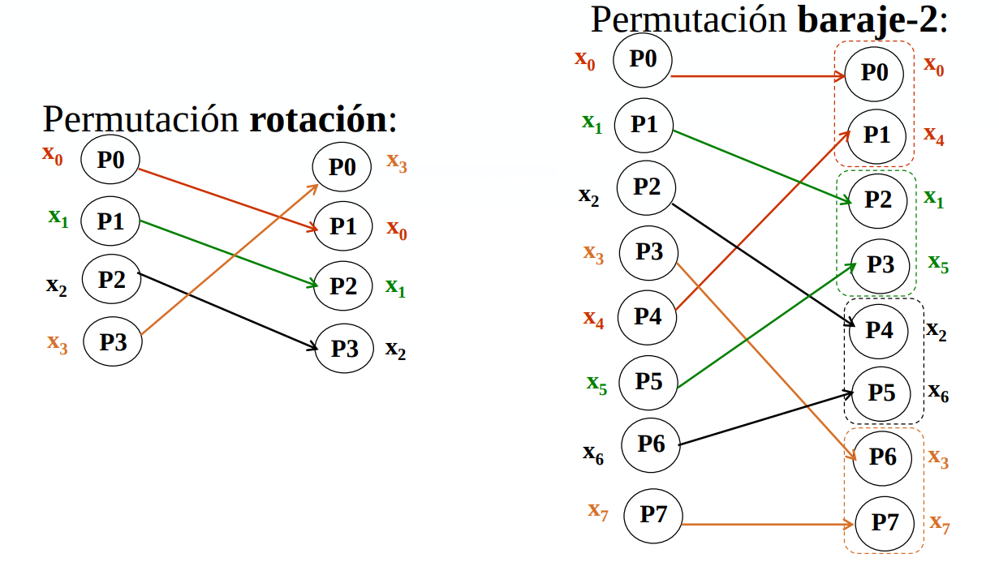

Se caracteriza porque hay componentes del grupo que envían un único mensaje  y componentes que reciben un único mensaje. Se usan permutaciones (aplicaciones biyectivas).

#### Comunicación todos-a-todos

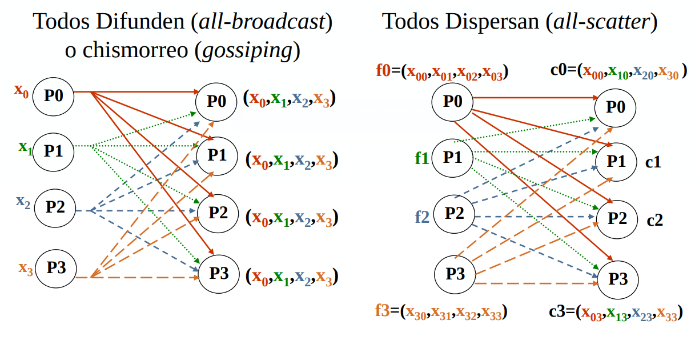

Todos los procesos del grupo ejecutan una comunicación uno-a-todos. Todos los procesos reciben $n$ mensajes, cada uno de un proceso diferente.

* **Todos difunden:** todos los procesos realizan una difusión. Usualmente las $n$ transferencias recibidas por un proceso se concatenan en función del identificador del proceso.
* **Todos dispersan:** en este caso los procesos concatenan diferentes transferencias.

> Ejemplo de uso del todos dispersan:
>
> _Trasposición de una matriz 4x4 (el del gráfico): cada procesador $P_i$ dispersa la fila $i$ (_$x_{i0}, x_{i1},...$). Tras la ejecución, $P_i$ tendrá la columna $i$ ($x_{0i},x_{1i},...$).
>
> *Cada uno de los flujos de instrucciones opera con una fila de una matriz, cada uno de los trabajos es independiente (en este caso la matriz es 4x4, cuatro flujos --uno para cada fila--). Si en algún momento el paralelismo requiere que el paralelismo trabaje con una columna (transposición de matrices), cada uno de los flujos de instrucciones debería tener una columna; usando comunicación uno a uno habría que hacer muchas, mientras que con este tipo de comunicación habríamos conseguido nuestro objetivo.*

#### Servicios compuestos

|                                  |                                  |
| -------------------------------- | -------------------------------- |
| 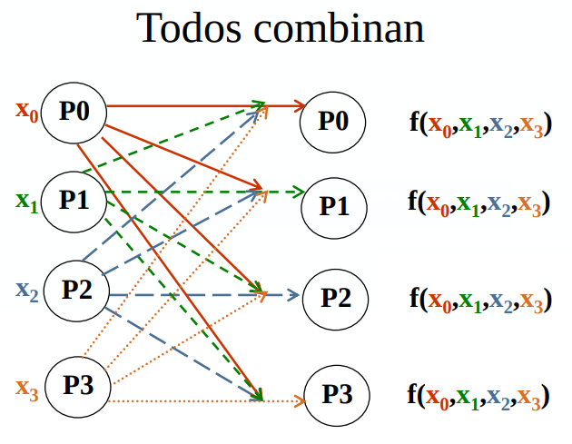 | 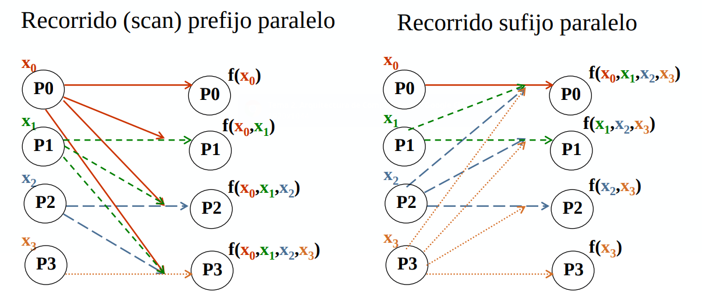 |

Resultan de una combinación de algunos de los anteriores.

* **Todos combinan o reducción y extensión:** todos los procesos obtienen el resultado de aplicar una reducción, difundiéndola una vez obtenida (**reducción y extensión**) o realizándola en todos los procesos (**todos combinan**).
* **Recorrido (_scan_):** todos los procesos envían un mensaje, recibiendo cada uno de ellos el resultado de reducir un conjunto de estos mensajes.
  * Scan prefijo paralelo: cada uno recibe una reducción de una cantidad de datos distinta.

> Ejemplo de uso de todos combinan
>
> _Para calcular la desviación típica (cada uno de los flujos de instrucciones tiene los valores). Haciendo un todos reducen tendríamos la suma de todos los valores. Cuando acabe la reducción, cada uno tiene todas las reducciones con la sumatoria de x_i, y todos en paralelo calcularían la media. La sumatoria final, debido a que cada uno de los valores están en un procesador distinto. Con una reducción obtendríamos el resultado. Un todos reducen sería aplicable si lo necesitasen todos los flujos de instrucciones._
>
> _Realmente, cada flujo tendrá un subconjunto de los valores, no uno solo._
>
> Ejemplo de uso de scan prefijo paralelo
>
> _Puede usarse para la evaluación de un polinomio en un punto, con la $f$ un producto._

Internamente, se distribuyen las operaciones para que la complejidad del cálculo sea menor (con una estructura de árbol, en $\log n$).

Usar las funciones de comunicación que nos ofrecen las herramientas tiene otra ventaja: el programador puede realizar una implementación eficiente en función del hardware y del software.

_**Nota:** los $x_i$ pueden ser vectores._

### Paradigmas de programación paralela

El estilo de programación que nos ofrecen las herramientas varían porque cada una de ellas ofrece una estructura lógica del hardware distinta de la estructura real del hardware.

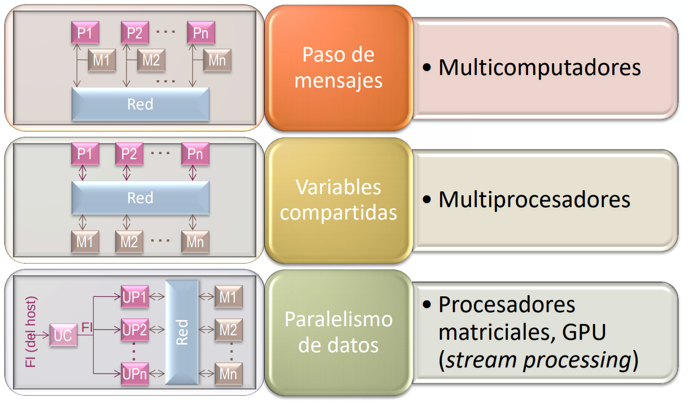

* **Paso de mensajes (_message passing_):** nos ofrecen modelo de hardware en el que cada flujo de instrucciones tiene espacio de direcciones particular. Suele ser empleado en multicomputadores. Normalmente disponemos de las funciones principales `send(destino, datos)` y `receive(fuente, datos)`. Por lo general podemos encontrar transmisiones síncronas (cuando ejecutamos un `send`, el proceso se bloquea hasta que el destino recibe el dato y viceversa con `receive`) o asíncronas (`send` no bloquea, por lo que suele hacerlo `receive`).
  * Lenguajes de programación: Ada, Occam.
  * API (bibliotecas de funciones): MPI, PWM.
* **Variables compartidas (_shared memory, shared variables_):** suponen que comparten el mismo espacio de direcciones. La comunicación se realiza accediendo a variables compartidas, es decir, mediante accesos y escrituras en memoria. Las hebras de un proceso creadas por el SO pueden compartir inmediatamente variables globales, pero los procesos no (tienen diferentes espacios de direcciones). En este caso, hemos de utilizar llamadas al sistema específicas. Se implementa fácilmente en multiprocesadores.
  * Lenguajes de programación: Ada, Java.
  * API (directivas del compilador + funciones): OpenMP.
  * API (bibliotecas de funciones): POSIX Threads, shmem, Intel TBB (Threading Building Blocks), C++ con clases thread, mutex, atomic... 
* **Paralelismo de datos (_data parallelism_):** se corresponde con SIMD, se aprovecha el paralelismo de datos inherente a aplicaciones en las que los datos se organizan en estructuras (vectores o matrices). El programador escribe un programa con construcciones que permiten aprovechar el paralelismo, para paralelizar bucles, distribuir datos, etc. Por tanto, no ha de ocuparse de las sincronizaciones, que son implícitas.
  * Lenguajes de programación + funciones: HPF (High Performance Fortran), Fortran 95, Nvidia CUDA, C* (C star).
  * API (directivas del compilador + funciones - _stream processing_): OpenACC (se espera que sea un estándar para paralelismo de datos. Está dentro de OpenMP, implementado incluso ya en `gcc`).

### Estructuras típicas de códigos paralelos

Estructuras que podemos encontrarnos típicamente en procesos o en tareas en códigos paralelas, hay pocos y es conveniente que veamos cuáles son.

Son cuatro, hay una más de programación distribuida.

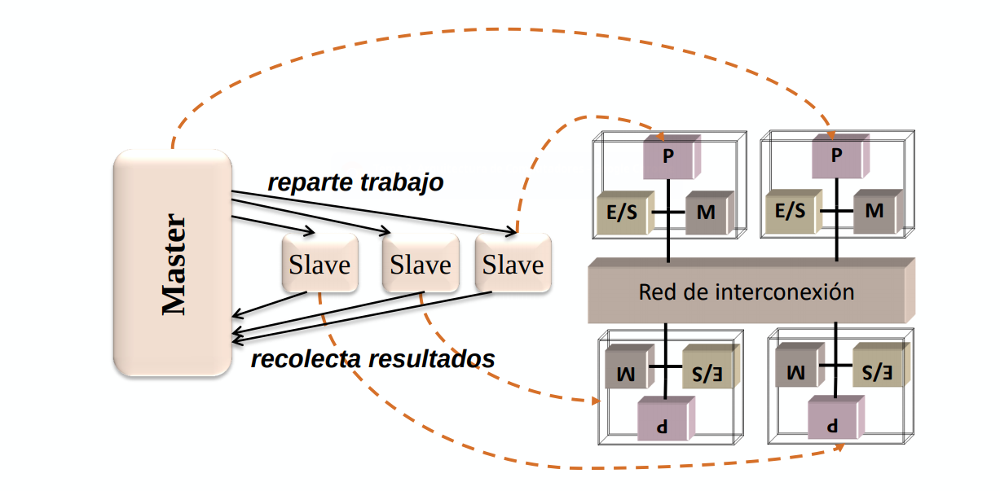

> En estas estructuras, los vértices son bien flujos de instrucciones (con rectángulos con bordes redondeados) o bien tareas (con círculos), los arcos son pasos de flujos de datos.

* **Maestro-esclavo o granja de tareas**
  * En la estructura de procesos se distingue un **proceso dueño** y múltiples **esclavos**. El proceso dueño se encarga de distribuir un conjunto de tareas entre los esclavos y de ir recolectando los resultados particales que éstos van calculando. Al final, el proceso maestro obtiene el resultado completo.
  * Normalmente no hay comunicación entre esclavos.
  * Típicamente, los esclavos ejecutan el mismo código (SPMD, un sólo programa para master y esclavos), en master podemos hacer un código distinto (vemos un MPMD como SPMP, podemos implementar esta estructura de forma mixta MPMD-SPMD con un programa para el dueño y otro para los esclavos.).
  * Típicamente, para que el master no permanezca ocioso también se reparte a él mismo.

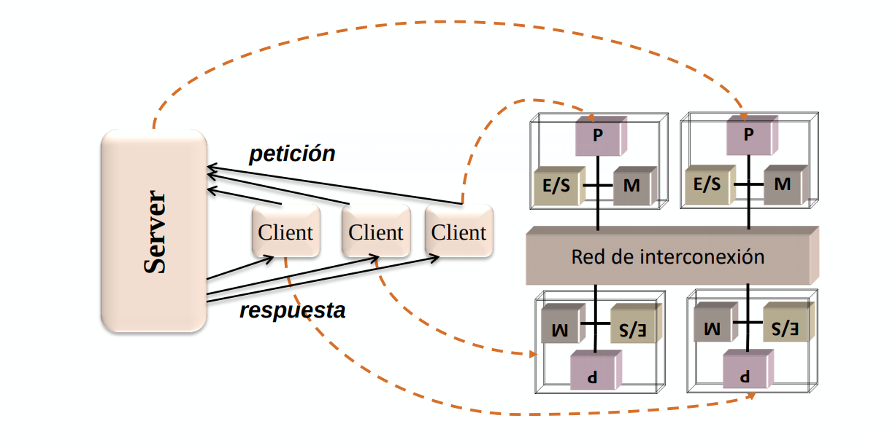

* **Cliente-servidor** (procesamiento distribuido)
  * Los clientes piden a otro computador que le haga un trabajo, y devuelve la respuesta (el contrario).

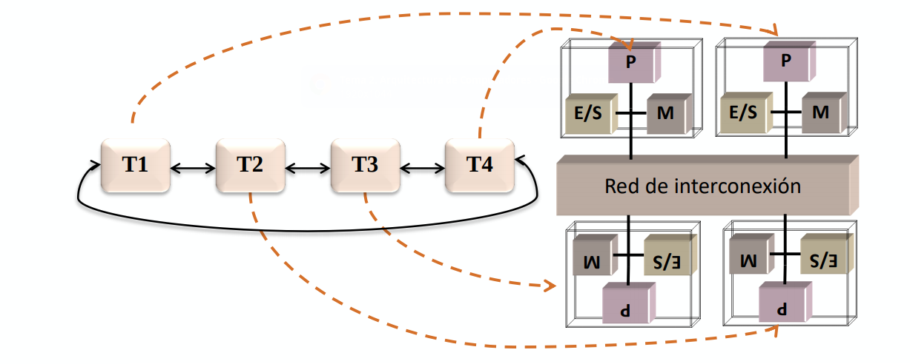

* **Descomposición de dominio o descomposición de datos**

  * Usado para problemas en los que se opera con grandes estructuras de datos.

  * La estructura de datos de entrada o la de salida, o ambas, se dividen en partes. A partir de esta división se derivan las tareas paralelas. Puede haber comunicación entre procesos.

  * Cuando se aplica para obtener qué tareas vamos a asignar a cada flujo de instrucciones, típicamente obtenemos comunicación entre parejas de flujos de instrucciones. A veces podemos llegar a estructuras donde no hay ni siquiera comunicación.

  * Podemos determinar qué tareas vamos a asignar a cada uno de los flujos de instrucciones dividiendo la estructura de datos de salida, entrada o ambas. Normalmente se aplica a dominios de simulación, que representamos en matrices.

  * En cada paso de simulación, antes de repetir los cálculos se hace intercambio de los datos de los trozos que requieren comunicación. Dependiendo del modelo que utilicemos pueden aparecer comunicaciones uno a todos, todos a uno o todos a todos (dependen de los métodos numéricos que estemos utilizando). En algunos modelos aparecen reducciones.

  * Ejemplos:

    * Descomposición gaussiana

    * Producto matriz-vector: estamos particionando las salidas, y también las entradas realmente porque estamos usando en cada uno de los threads datos muy restringidos.

      Si particionamos las entradas, por columnas. Al flujo de instrucciones i de cálculo le asignaríamos todos los cálculos que usan los valores de la matriz de sus columnas. La partición de cálculos es la que aparece a la derecha. Todos los flujos de instrucciones tendrán parte de cada $c_i$. Para obtener el resultado definitivo, deberíamos sumar los trozos de $c_i$ que calcula cada flujo de instrucciones. Aquí es necesaria comunicación: reducción para cada uno de los $c_i$.

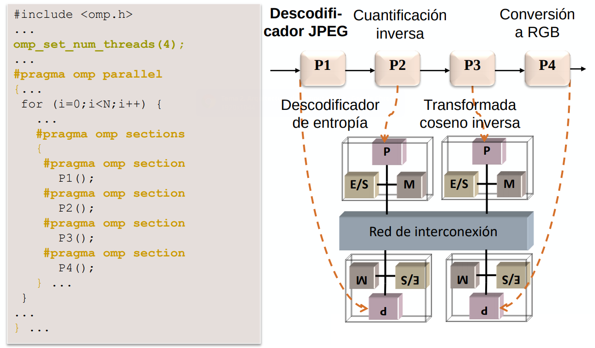

* **Segmentación o flujo de datos**

  * Aparece en problemas en los que se aplican distintas funciones a un mismo flujo de datos (paralelismo de tareas). La estructura de procesos y de tareas es la de un cauce segmentado, cada proceso ejecuta código distinto (MPMD).
  * Cuando descomposición de dominio no es posible, deberíamos ver si podemos utilizar esta estructura, aunque realmente para poder aplicarla necesitamos que se aplique a una secuencia de datos de entrada o a un flujo de datos de entrada en secuencia una serie de operaciones (una detrás de otra): el flujo operado entra por P1, y la salida de P1 es la entrada de P2, así sucesivamente.
  * Se usa en streaming multimedia: se reciben bloques de forma secuencial.
  * Ejemplo:
    - Decodificador JPEG: para decodificar el bloque, seguimos una secuencia que usa datos del píxel anterior, igualmente para bloques. Cuando el 0,0 llegue a conversión RGB, el 0,1 estaría en la transformada coseno inversa, el 1,0 estaría en la cuantificación inversa... Tenemos cuatro bloques decodificándose a la vez, cada uno en una etapa distinta de decodificación.

  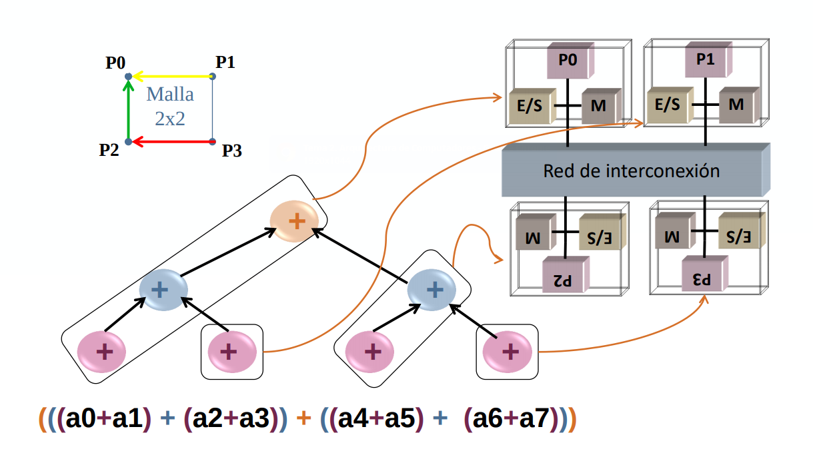**Divide y vencerás o descomposición recursiva**
  * Esta estructura se utiliza cuando un problema se puede dividir en dos o más subproblemas, de forma que cada uno se puede resolver independientemente, combinándose los resultados para obtener el resultado final.
  * Se usa en aplicaciones en las que resolvemos un problema cuya solución se puede obtener dividiéndolo en subproblemas.
  * Para paralelizarlo, podemos hacerlo como en el ejemplo. Luego, debemos tener cuidado con la asignación de procesadores (depende de arquitectura, por ejemplo, si la comunicación no es uniforme --no todos los procesadores tardan lo mismo en comunicarse--). Actualmente los procesadores a nivel de placa son NUMA: tenemos que tener en cuenta los procesadores.

**Grado de paralelización:** número máximo de tareas que podemos ejecutar en paralelo (en el ejemplo de la suma -diap.34-, es 4).

Mientras menos flujos mejor: más flujos = más coste (más tiempo para crearlos y matarlos).

_**Nota:** al quitar comunicación, obtenemos redundancia en los cálculos (pero la comunicación supone más tiempo)._

## Lección 5. Proceso de paralelización

1. **Descomponer (_decomposition_)** en tareas independientes o localizar paralelismo.
2. **Asignar** (planificar + mapear, _schedule + map_) tareas a procesos y/o threads.
3. **Redactar** código paralelo.
4. **Evaluar** prestaciones.

### 1. Descomposición en tareas independientes

En esta fase el programador busca unidades de trabajo independientes, es decir, que se podrán ejecutar en paralelo. Estas unidades, junto con los datos que utilizan, formarán las **tareas**.

Podemos partir de un código secuencial, de una representación matemática o de una representación de la aplicación.

Si partimos de un código secuencial:

* Es conveniente representar en esta fase la estructura mediante un grafo dirigido. Los arcos representan flujo de datos y de control y los vértices representan tareas. De este modo, se puede comprobar gráficamente las tareas que se pueden paralelizar y las dependencias entre ellas.
* Nos podemos situar en dos niveles de abstracción:
  * **Nivel de función:** analizando las dependencias entre las funciones del código, encontramos las que son independientes o las que se pueden hacer independientes y por tanto se pueden ejecutar en paralelo. _Paralelismo de tareas._
  * **Nivel de bucle:** analizando las iteraciones de los bucles dentro de las funciones podemos encontrar si son o se pueden hacer independientes. Con ello podemos detectar paralelismo de datos. _Paralelismo de datos._

> Ejemplo: cálculo de PI
>
> ```c
> sum = sum + __
> sum = sum + __
> ```
>
> Tenemos WAW, WAR y RAW
>
> Eliminamos WAW escribiendo en otra variable: hacemos los `sum` local a cada flujo.

### 2. Asignar (planificar+mapear) tareas a flujos (procesos o hebras)

Hay dos asignaciones:

* Asignación de tareas a flujos: **planificación**.
* Asignación de flujos a procesadores: **mapeo**. Lo idel es que haya tantos threads como procesadores, para no tener que conmutar en cada procesador.
  * OpenMP hace esto por nosotros.

Por lo general, en una misma aplicación no resulta conveniente asignar más de un proceso o hebra por procesador, por lo que la asignación a procesos o hebras está ligada con la asignación a procesadores. Es más, se puede incluso realizar la asignación asociando los procesos (hebras) a procesadores concretos.

La posibilidad de usar procesos y/o hebras depende de:

* La **arquitectura** en la que se ejecute el programa. En SMP (_Symmetric Multi-Processing_) y en procesadores multihebra es más eficiente usar hebras, mientras que en arquitecturas mixtas (como clústers de SMPs) es conveniente usar tanto hebras como procesos.
* El **SO** debe ser multihebra.
* La **herramienta de programación** debe permitir el uso de hebras.

Como regla básica, se tiende a asignar:

* iteraciones de un bucle (paralelismo de datos) -> hebras.
* funciones (paralelismo de tareas) -> procesos.

Un aspecto muy importante es **equilibrar la carga de trabajo**: hacer la asignación de forma que se consiga que entre comunicaciones ningún flujo de instrucciones esté ocioso. Lo conseguimos si logramos equilibrar el trabajo entre los diferentes flujos de instrucciones. El tamaño entre comunicaciones dependerá del número de procesadores que usemos (hemos de optimizar la comunicación y la sincronización, de forma que todos los procesadores empiecen y acaben a la vez).

#### Asignación de tareas a procesos/threads

Incluimos: agrupación de tareas en procesos/threads (_scheduling_) y mapeo a procesadores/cores (_mapping_).

La **granularidad** de la carga de trabajo (tareas) asignada a los procesos/threads depende de:

* número de cores o procesadores o elementos de procesamiento.
* tiempo de comunicación/sincronización frente a tiempo de cálculo.

**¿De qué depende el equilibrado de la carga?**

* Arquitectura: homogénera vs heterogénea (asignar más trabajo a nodos más rápidos), homogénea puede ser uniforme (la comunicación de los procesadores con memoria --multiprocesadores-- o entre sí --multicomputadores-- supone el mismo tiempo sean cuales sean los nodos que intervengan) vs no uniforme.
* La aplicación/descomposición.

##### Tipos de asignación

* **Estática:** está determinado qué tarea va a realizar cada procesador o core.
  * Explícita: programador.
  * Implícita: herramienta de programación al generar el código ejecutable.
* **Dinámica (en tiempo de ejecución):** distintas ejecuciones pueden asignar distintas tareas a un procesador o core.
  * Explícita: programador.
  * Implícita: herramienta de programación al generar el código ejecutable.

Hay aplicaciones en las que necesariamente debemos usar la asignación dinámica: en los que en ningún momento se conoce el número de tareas que se pueden ejecutar en paralelo. Ejemplo: simulaciones.

A veces el equilibrado de la carga es complicado por la aplicación y otras por la carga.

* Ejemplo: bucle en el que todas las iteraciones tienen distinto tiempo. ¿Cómo conseguimos equilibrado de la carga? Se recurre a asignación en tiempo de ejecución.
* Otro: aunque las tareas tarden distinto tiempo me resultará difícil debido a la arquitectura (arquitectura heterogénea). Hay que asignarle más trabajo a los más rápidos: esto es difícil de conocer de antemano. Para ello, también recurrimos a asignación dinámica.

La asignación dinámica añade sobrecarga. Con la estática no añadimos código extra, sin embargo, en la dinámica debemos añadir más código.

> `lock` y `unlock` son funciones que hacen que los thread ejecuten las operaciones secuencialmente, para que más de uno de los thread no tome el mismo valor de $n$.

##### Mapeo de procesos/threads a unidades de procesamiento

* Normalmente se deja al SO el mapeo de threads (_light process_).
* Lo que puede hacer el entorno o sistema en tiempo de ejecución (_runtime system_ de la herramienta de programación).
* El programador puede influir.

### 3. Redactar código paralelo

Esta redacción depende de la herramienta de programación que vayamos a usar (estilo de programación, variables compartidas, paso de mensajes y paralelismo de datos; y modo de programación, SPMD, MPMD, mixto, etc.).

Podemos partir de un código secuencial: añadimos modificaciones para paralelizarlo. Usando OpenMP, por ejemplo, hacemos uso de la biblioteca de funciones y las directivas de preprocesador, etc.

### 4. Evaluar prestaciones

Se estudia en la lección siguiente.

## Lección 6. Evaluación de prestaciones en procesamiento paralelo

* Medidas usuales
  * **Tiempo de respuesta:** tiempo que supone la ejecución de una entrada en el sistema.
    * Real (_wall-clock time, elapsed time_) (`/usr/bin/time`).
    * Usuario, sistema, CPU time (user + sys).
  * **Productividad:** número de entradas que el computador es capaz de procesar por unidad de tiempo.

En procesamiento paralelo nos interesa el tiempo de respuesta, más que la productividad. Hay sistemas orientados a la mejora de la productividad (asignan cada entrada a un nodo de cómputo diferente), a la mejora del tiempo de respuesta (dividiendo el trabajo entre procesos) y orientados a ambos propósitos, como los servidores de internet.

* **Escalabilidad:** evolución del incremento en presentaciones que se consigue en el sistema conforme se añaden recursos. Pretende medir el aprovechamiento efectivo de éstos.
* **Eficiencia:**
  * Relación prestaciones / prestaciones máximas.
  * Rendimiento = prestaciones / nº recursos.
  * Otras: prestaciones / consumo potencia, prestaciones / área ocupada.

Otras medidas adicionales de prestaciones:

* **Funcionalidad.** Cargas de trabajo para las que está orientado el diseño de la arquitectura.
* **Alta disponibilidad.** Presencia de recursos y software en el sistema para reducir el tiempo de inactividad y la degradación de prestaciones ante un fallo o por mantenimiento.
* **RAS (_Reliability, Availability, Serviceability_).** Comprende tres propiedades cruciales: *fiabilidad* (capacidad del sistema de producir siempre los mismos resultados para las mismas entradas), *disponibilidad* (grado en el que un sistema sufre degradación de prestaciones o detiene su funcionamiento por fallos o mantenimientos_ y *serviciabilidad* (facilidad con la que un técnico de hardware puede realizar el mantenimiento).
* Tolerancia a fallos. Capacidad de un sistema de mantenerse en funcionamiento ante un fallo.
* Expansibilidad. Posibilidad de expandir el sistema modularmente.
* Escalabilidad. Evolución del incremento (ganancia) en prestaciones que se consigue en el sistema conforme se añaden recursos (principalmente procesadorees). Pretende medir el nivel de aprovechamiento efectivo de los recursos.
* Consumo de potencia. Afecta a los costos de mantenimiento.

También se suele hablar de eficiencia, con la que se evalúa en qué medida las prestaciones que ofrece un sistema para sus entradas se acerca a las prestaciones máximas que idealmente debería ofrecer dados los recursos de los que dispone. Es decir, se emplea para evaluar en qué medida se utilizan los recursos del sistema

### Ganancia en prestaciones. Escalabilidad

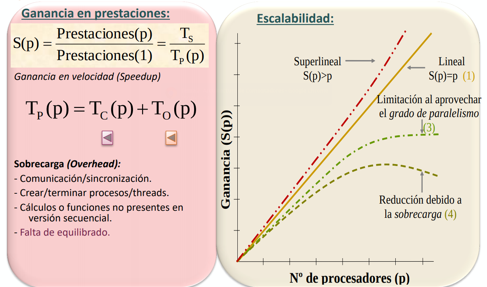

Dividimos las prestaciones logradas con $p$ procesadores entre las prestaciones que nos da un sistema con un único procesador.
- $T_P(p)$ : tiempo de ejecución en paralelo con $p$ procesadores.
- $T_C(p)$ : tiempo de cálculo en paralelo.
- $T_O(p)$ : tiempo de penalización (_overhead_).

**Tiempo de sobrecarga:** tiempo para enrolar y desenrolar, comunicación, llamadas a funciones u operaciones extra que necesita nuestro código paralelo (ej. reparto de trabajo, número de procesos, identificador de proceso...). A veces se introduce la penalización por no haber logrado el equilibrado.

Depende del número de procesadores (depende del número de procesos que tengamos que crear/terminar). En algunos casos, puede ser un orden de $p$, $T_O(p)=kp$.

#### Estudio de escalabilidad

Se representa ganancia en prestaciones en función de número de prestaciones. Código mejor en cuanto sea lineal (ganancia máxima lineal).

1. Ganancia lineal. El grado de paralelismo debe ser ilimitado: siempre se puede dividir el código entre $p$ procesadores para cualquier valor de $p$. Además, el overhead es despreciable.
2. Ganancia superlineal, $S(p)>p$. Se debe a que al aumentar el número de procesadores aumentamos también otros recursos (caché, memoria principal, etc.) o bien que la aplicación debe explorar varias posibilidades y termina cuando es una solución.
3. Limitación al aprovechar el grado de paralelismo. Se produce cuando hay código no paralelizable y la paralelización que se puede realizar no mejora las prestaciones.
4. Reducción debida a la sobrecarga. Se produce cuando el incremento del número de procesadores no hace que el programa sea más rápido, pero sí hace que el _overhead_ sea mayor.

#### Modelos de código

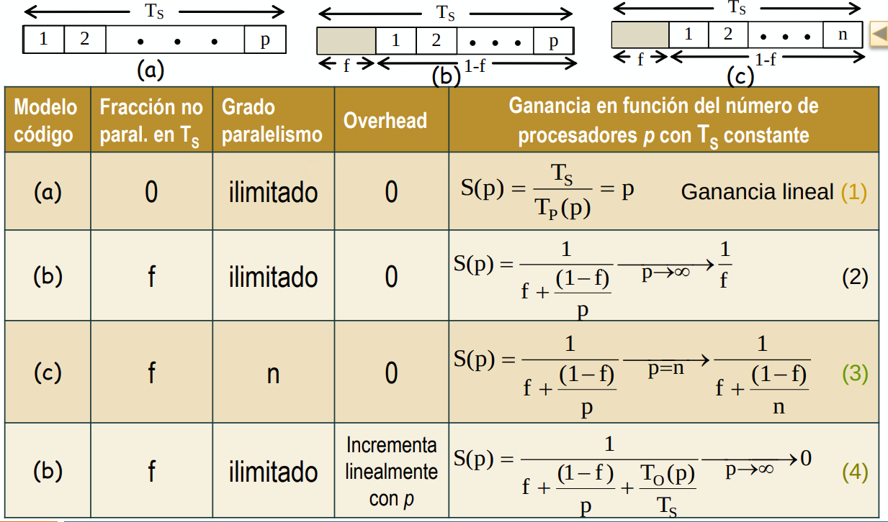

###### a. Ideal

Todo el trabajo se puede paralelizar. No hay código no paralelizado. Además, se puede distribuir el trabajo entre los procesadores de forma equitativa (equilibrado perfecto), con grado de paralelismo ilimitado (cualquier número de procesadores), y sin overhead. En este caso:
$$
T_P(p)=\frac{T_S}{p}
$$
###### b.

En otro caso, tenemos una parte de código no paralelizado, en el que la paralelización es ilimitada.
$$
T_P(p)=fT_S + (1-f)T_S
$$
###### c.

En la práctica es difícil que el grado de paralelismo sea ilimitado: el número de tareas limitado a $n$, consideramos que no hay sobrecarga. Expresión de ganancia igual, pero no podemos hacer $p\rightarrow\infty$, como mucho $p\rightarrow n$. La limitación (en gráfica 3) se debe a que ha alcanzado el grado máximo de paralelismo. En la práctica disminuye por sobrecarga (ver d).

###### d.

En caso de tener sobrecarga, se va a 0.

Mi aplicación es mejor cuanto más se acerque a la línea recta. Hay casos que podemos conseguir **ganancia superlineal**. Principalmente, esto ocurre porque las aplicaciones no sólo se aprovechan de que añadimos procesadores, sino que cuando añadimos procesadores añadimos más recursos con ellos (ej. multiprocesador y añadimos un nuevo procesador, añadimos núcleos de procesamiento y memoria caché: si mis aplicaciones se benefician de la memoria extra podemos tener mucha ganancia).

Una aplicación escala en un rango de procesadores si la ganancia en prestaciones crece con una pendiente constante cercana a la unidad.

La ganancia en prestaciones está limitada por $f$. Esto es precisamente lo que nos dice la ley de Amdahl, que apareció en este contexto de procesamiento paralelo.

### Número de procesadores óptimo

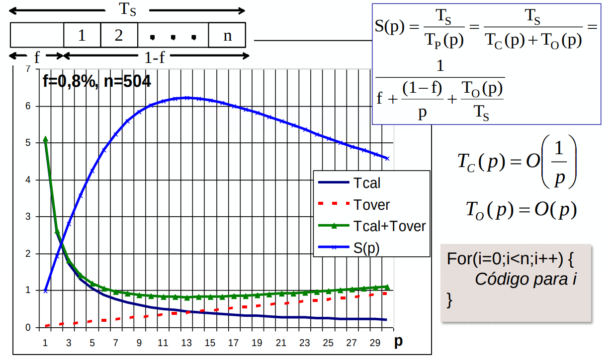

### Ley de Amdahl

Amdahl era pesimista con el uso de los multiprocesadores, creía que no se iban a poder usar en aplicaciones reales: creía que todas las aplicaciones tenían una parte que no se podía paralelizar.

No tuvo en cuenta que el objetivo de aumentar el número de procesadores no es sólo para reducir el tiempo de ejecución, también podemos usarlo para aumentar la calidad de los resultados, aumentando el tamaño del problema que resolvemos.

La ganancia en prestaciones utilizando $p$ procesadores está limitada por la fracción de código que no se puede paralelizar.
$$
S(p) = \frac{T_S}{T_P(p)} \leq \frac{T_S}{f·T_S + \frac{(1-f)·T_S}{p}} = \frac{p}{1+f(p-1)} \longrightarrow \frac{1}{f}\;\; (p\rightarrow\infty)
$$

* $S$ : incremento en velocidad que se consigue al aplicar una mejora.
* $P$ : incremento en velocidad máximo que se puede conseguir si se aplica la mejora todo el tiempo.
* $f$ : fracción de tiempo en el que no se puede aplicar la mejora.

Si el tiempo de ejecución es suficientemente pequeño, podemos seguir añadiendo procesadores para aumentar la magnitud del problema obteniendo resultados más precisos.

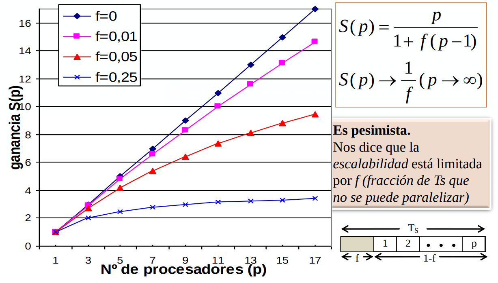

### Ganancia escalable

Este análisis es pesimista y nos dice que la escalabilidad está limitada por $f$ (fracción det iempo que no se puede paralelizar). Sin embargo, la ganancia se puede incrementar aumentando el tamaño del problema.

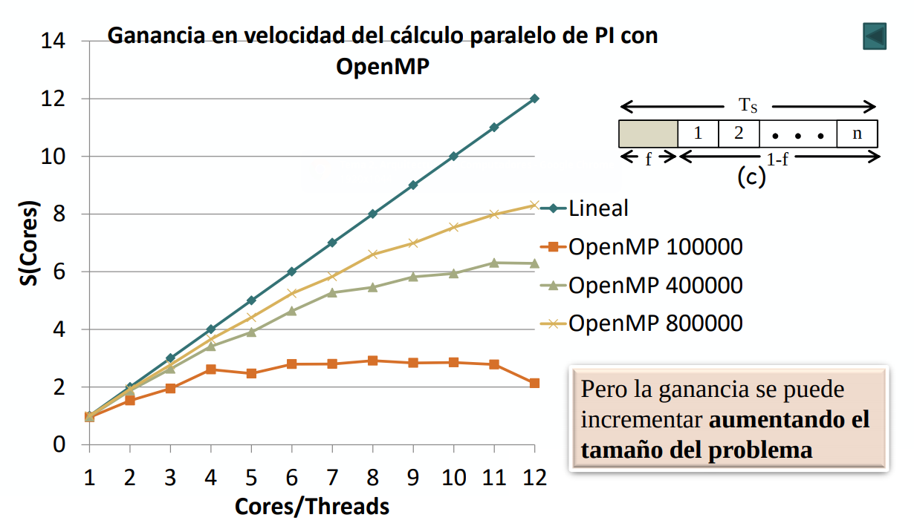

#### Ganancia escalable o Ley de Gustafson

Los objetivos al paralelizar una aplicación pueden ser:
- Disminuir el tiempo de ejecución hasta que sea razonable
- Aumentar el tamaño del problema a resolver.

Cuando llegamos a un nivel aceptable de tiempo de ejecución en paralelo para la aplicación, el siguiente objetivo que podemos tener es aumentar el tamaño del problema para mejorar otros aspectos de las prestaciones de la aplicación. Si consideramos el _overhead_ insignificante, podemos mantener constante el tiempo de ejecución paralelo $T_P$ variando el número de procesadores $p$ y el tamaño $n$ de forma que $n=kp,k\in\mathbb{R}$. Bajo estas condiciones, la ganancia en prestaciones sería:
$$
S(p)=\frac{T_\text{secuencial}(n)}{T_\text{paralelo}}=\frac{f·T_\text{paralelo}+p(1-f)·T_\text{paralelo}}{T_\text{paralelo}}=p(1-f)+f
$$


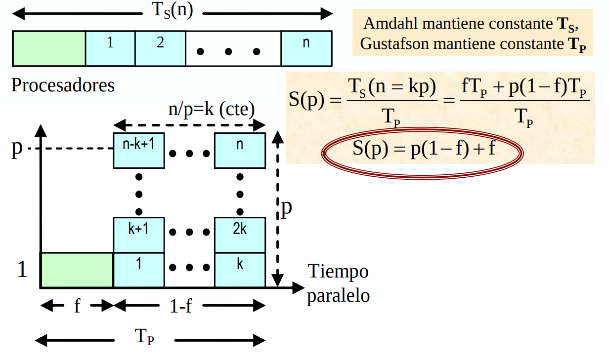

---

**Eficiencia.** Permite evaluar en qué medida las prestaciones ofrecidas para un programa paralelo se acercan a las prestaciones máximas que idealmente debería ofrecer.
$$
E(p,n)=\frac{\text{Prestaciones}(p,n)}{\text{Prestaciones}(1,n)}=\frac{S(p,n)}{p}
$$
donde:

* $p$ : número de recursos (procesadores).
* $n$ : tamaño del problema.

La eficiencia máxima que podemos alcanzar es 1, y la mínima es de $1/p$.