# Tema 3. Arquitecturas con paralelismo a nivel de thread (TLP)

## Lección 7. Arquitecturas TLP

### Clasificación y estructura de arquitecturas con TLP explícito y una instancia del SO

+ **Multiprocesador:** ejecutan varios threads en _paralelo_ en un _computador_ con varios cores/procesadores (cada thread en un core/procesador distinto).
+ **Multicore o multiprocesador en un chip o CMP (_Chip MultiProcessor_):** ejecutan varios threads en _paralelo_ en un _chip de procesamiento_ multicore (cada thread en un core distinto).
+ **Core multithread:** core que modifica su arquitectura ILP para ejecutar threads _concurrentemente_ o en _paralelo_.

### Multiprocesadores

Ejecutan varios threads en _paralelo_ en un _computador_ con varios cores/procesadores (cada thread en un core/procesador distinto).

#### Clasificación por sistema de memoria

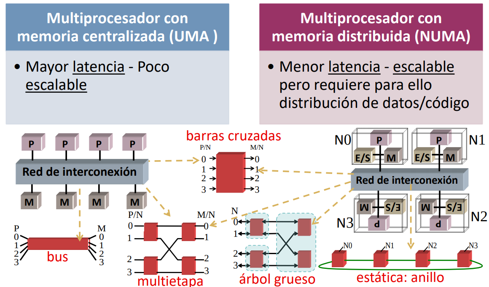

> Lección 1

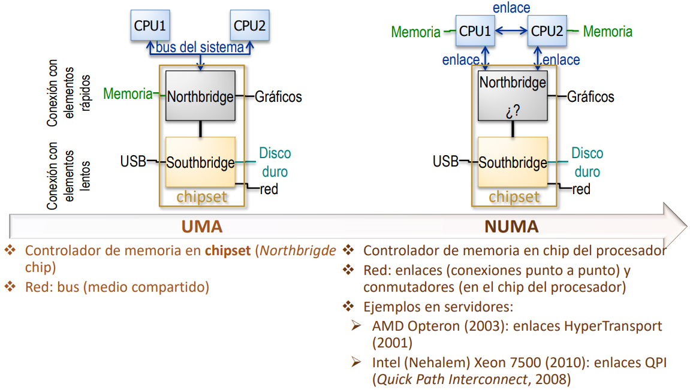

| Multiprocesador con memoria centralizada (UMA) | Multiprocesador con memoria distribuida (NUMA)               |
| ---------------------------------------------- | ------------------------------------------------------------ |
| Mayor latencia Poco escalable             | Menor latencia Escalable, pero requiere para ello distribución de datos/código |
| Controlador de memoria en chipset              | Controlador de memoria en chip del procesador                |
| Red: bus (medio compartido)                    | Red: enlaces (conexiones punto a punto) y conmutadores (en el chip del procesador) |

#### Clasificación por nivel de empaquetamiento

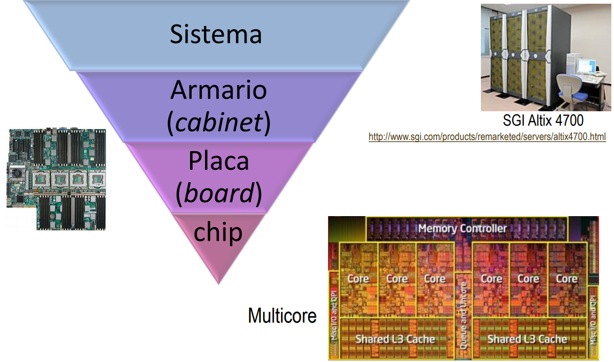

De mayor a menor:

* Sistema
* Armario (_cabinet_)
* Placa (_board_)
* Chip

###### Multiprocesador en una placa: UMA con bus (Intel Xeon 7300)

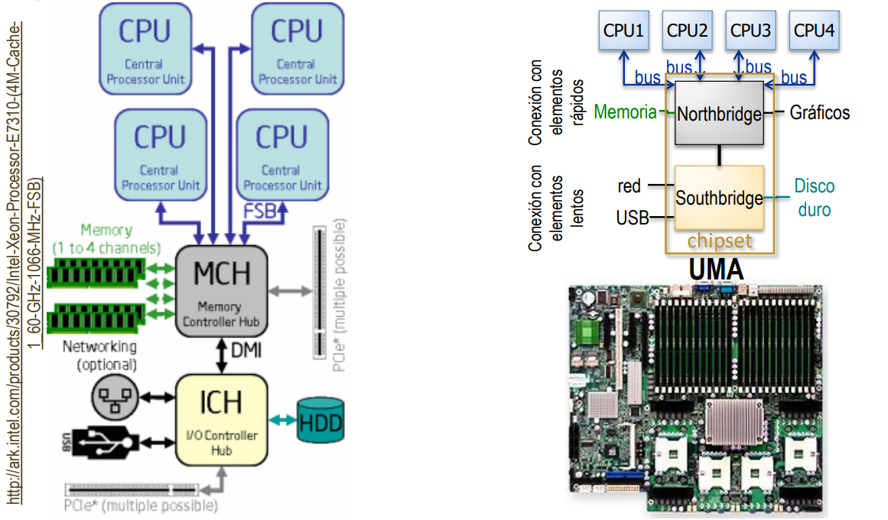

###### Multiprocesador en una placa: CC-NUMA con red estática (Intel Xeon 7500)

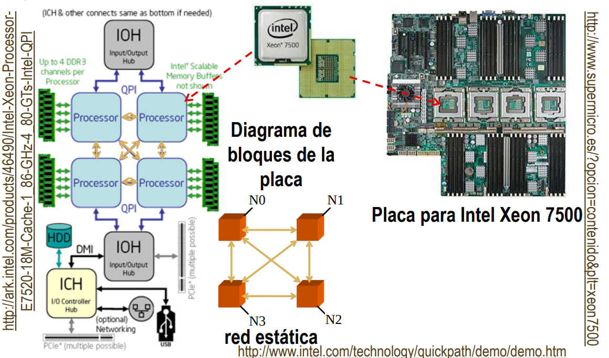

### Multicores

Ejecutan varios threads en _paralelo_ en un _chip de procesamiento_ multicore (cada thread en un core distinto).

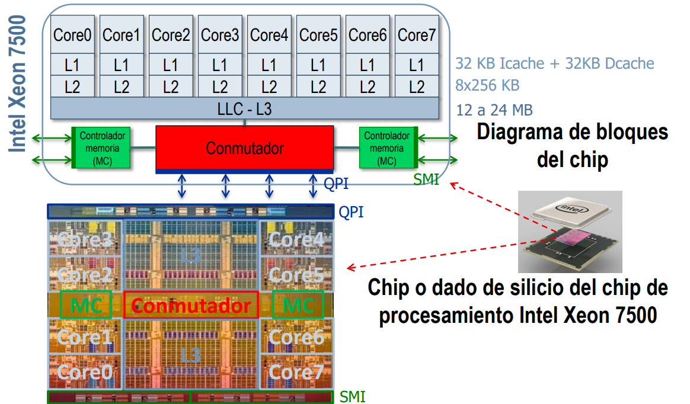

###### Otras posibles estructuras

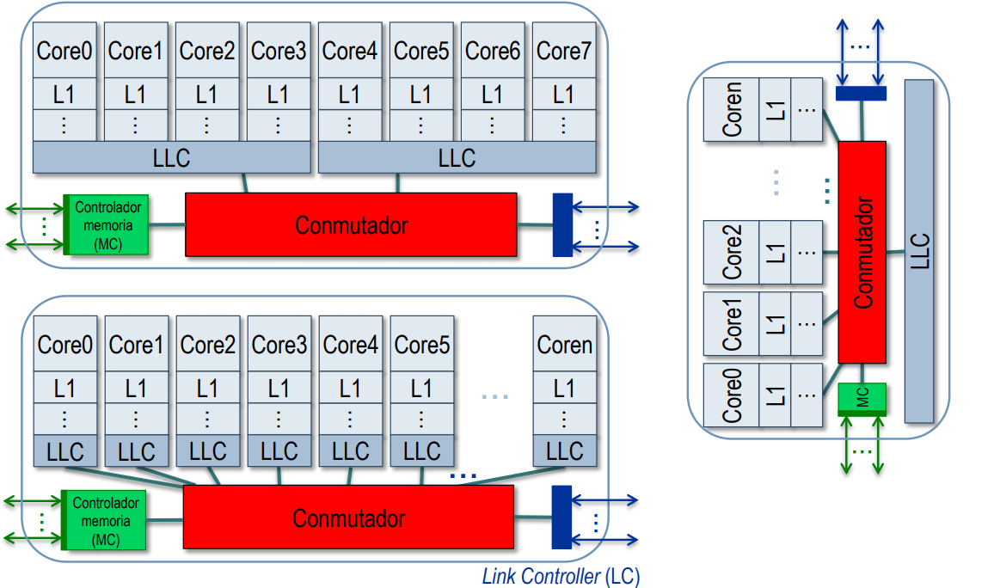

### Cores multihread

Modifican su arquitectura ILP para ejecutar threads _concurrentemente_ o en _paralelo_.

#### Arquitecturas ILP

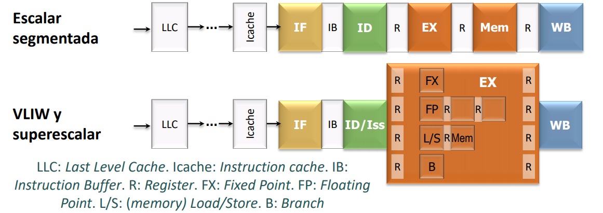

* **IF:** Etapa de captación de instrucciones (Instruction Fetch)
* **ID:** Etapa de decodificación de instrucciones y emisión a unidades funcionales (Instruction Decode)
* **EX:** Etapa de ejecución (Execution)

* **Mem:** Etapa de acceso a memoria
* **WB:** Etapa de almacenamiento de resultados (Write-Back)

---

##### Procesadores segmentados

Ejecutan instrucciones _concurrentemente_ segmentando el flujo de sus componentes.

##### Procesadores VLIW (Very Large Instruction Word) y superescalares

Ejecutan instrucciones _concurrentemente_ (segmentación) y en _paralelo_ (tienen múltiples unidades funcionales y emiten múltiples instrucciones en paralelo a unidades funcionales).

* **VLIW:**
  * Las instrucciones que se ejecutan en paralelo se captan juntas de memoria.
  * Este conjunto de instrucciones conforman la palabra de instrucción muy larga a la que hace referencia la denominación VLIW.
  * El hardware presupone que las instrucciones de una palabra son independientes: no tiene que encontrar instrucciones que pueden emitirse y ejecutarse en paralelo.
  * Cada instrucción especifica el estado de todas y cada una de las unidades funcionales del sistema, con el objetivo de simplificar el diseño del hardware al dejar todo el trabajo de planificar el código en manos del programador/compilador.
* **Superescalares:**
  * Tiene que encontrar instrucciones que puedan emitirse y ejecutarse en paralelo (tiene hardware para extraer paralelismo a nivel de instrucción).
  * El hardware planifica las instrucciones en tiempo de ejecución, teniendo que encontrar instrucciones que puedan emitirse y ejecutarse en paralelo (tiene hardware para extraer paralelismo a nivel de instrucción).
  * Taxonomía de Flynn: un procesador superescalar mononúcleo es SISD (Single Instruction, Single Data), aunque un procesador superescalar mononúcleo que permita operaciones vectoriales pueda clasificarse como SIMD (Single Instruction, Multiple Data). Un procesador superescalar multinúcleo es MIMD (Multiple Instructions, Multiple Data).

---

###### Modificación de la arquitectura ILP en Core Multithread (ej. SMT)

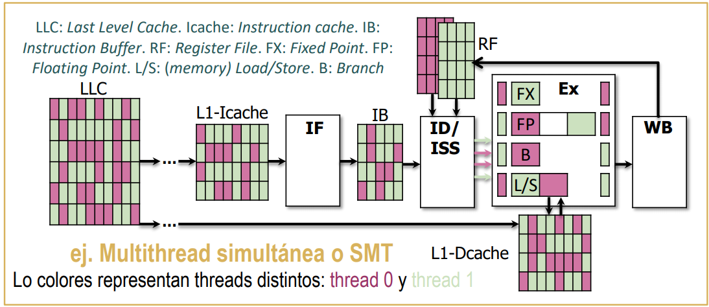

* Almacenamiento: se multiplexa, se reparte o se comparte entre threads, o se replica.
  * Con SMT: repartir, compartir o replicar.
* Hardware dentro de etapas: se multiplexa, o se reparte o comparte entre threads.
  * Con SMT: unidades funcionales (etapa Ex) compartidas, resto etapas repartidas o compartidas; multiplexación es posible (p. ej. predicción de saltos y decodificación).

#### Clasificación de cores multithread

* **Temporal Multithreading (TMT)**
  * Ejecutan varios threads *concurrentemente* en el mismo core.
    * La *conmutación* entre threads la decide y controla el hardware.
  * Emite instrucciones de un único thread en un ciclo.
  * **Fine-grain multithreading (FGMT) o *interleaved multithreading***
    * La conmutación entre threads la decide el hardware cada ciclo (coste 0)
      * por turno rotatorio (*round-robin*) o
      * por eventos de cierta latencia combinado con alguna técnica de planificación (ej. thread menos recientemente ejecutado).
        * Eventos: dependencia funcional, acceso a datos a cache L1, salto no predecible, una operación de cierta latencia (ej. div), …
  * **Coarse-grain multithreading (CGMT) o *blocked multithreading***
    * La conmutación entre threads la decide el hardware (coste de 0 a varios ciclos)
      * tras intervalos de tiempo prefijados (*timeslice multithreading*) o
      * por eventos de cierta latencia (*switch-on-event multithreading*).
  * Clasificación de cores CGMT con conmutación por eventos:
    * **Estática**
      * Comunicación:
        * Explícita: instrucciones explícitas para conmutación (instrucciones añadidas al repertorio)
        * Implícita: instrucciones de carga, almacenamiento, salto
      * Ventaja/Inconveniente:
        * coste cambio contexto bajo (0 o 1 ciclo) / cambios de contextos innecesarios
    * **Dinámica**
      * Conmutación típicamente por:
        * fallo en la última cache dentro del chip de procesamiento (conmutación por fallo de cache), interrupción (conmutación por señal), …
      * Ventaja/Inconveniente:
        * reduce cambios de contexto innecesarios / mayor sobrecarga al cambiar de contexto
* **Simultaneous MultiThreading (SMT)** o multihilo simultáneo o *horizontal multithread*
  * Ejecutan, en un core superescalar, varios threads en *paralelo*.
  * Pueden emitir (para su ejecución) instrucciones de varios threads en un ciclo.

| TMT                              | SMT                              | FGMT                             | CGMT                             |
| -------------------------------- | -------------------------------- | -------------------------------- | -------------------------------- |
|  | 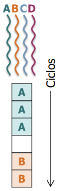 | 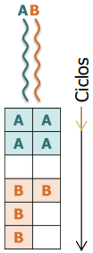 | 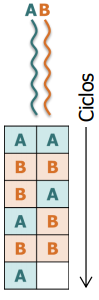 |

#### Alternativas en...

##### un core escalar segmentado

En un core escalar se emite una instrucción por cada ciclo de reloj.

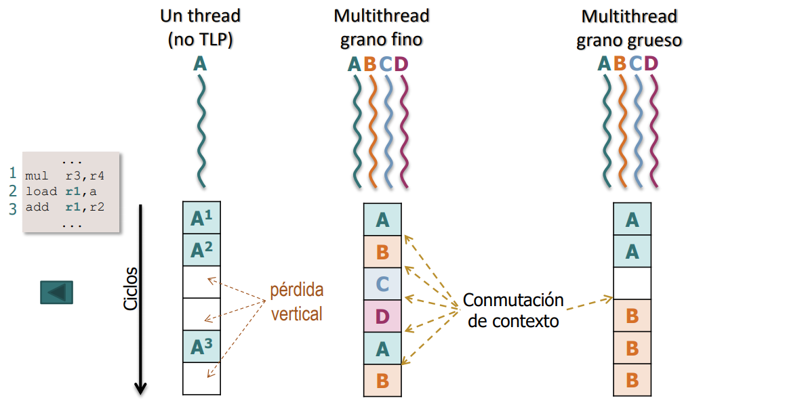

##### un core con emisión múltiple de instrucciones de un thread

En un core superescalar o VLIW se emiten más de una instrucción en un ciclo de reloj (en las alternativas de abajo, de un único thread).

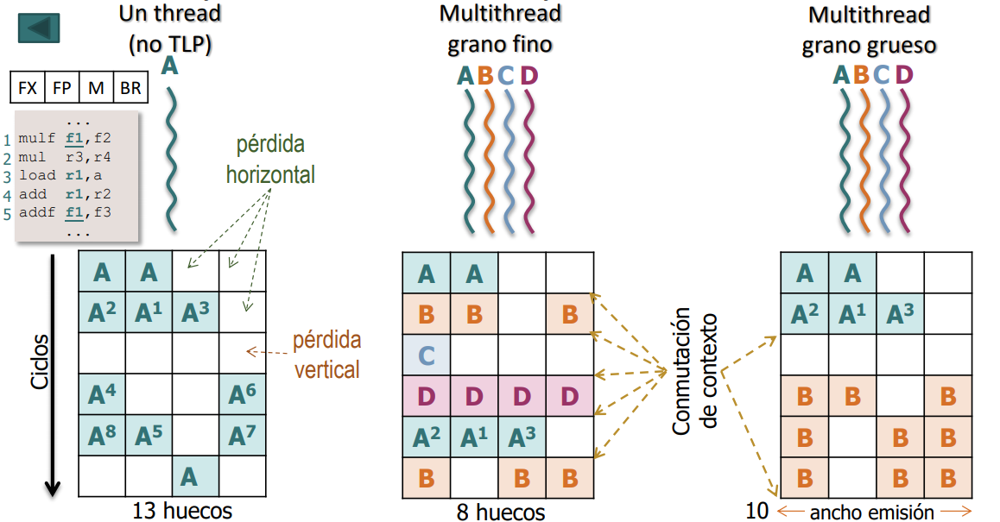

---

#### Core multithread simultánea y multicores

En multicore y en un core superescalar con SMT se pueden emitir instrucciones de distintos threads en cada ciclo de reloj.

---

### Hardware y arquitecturas TLP en un chip

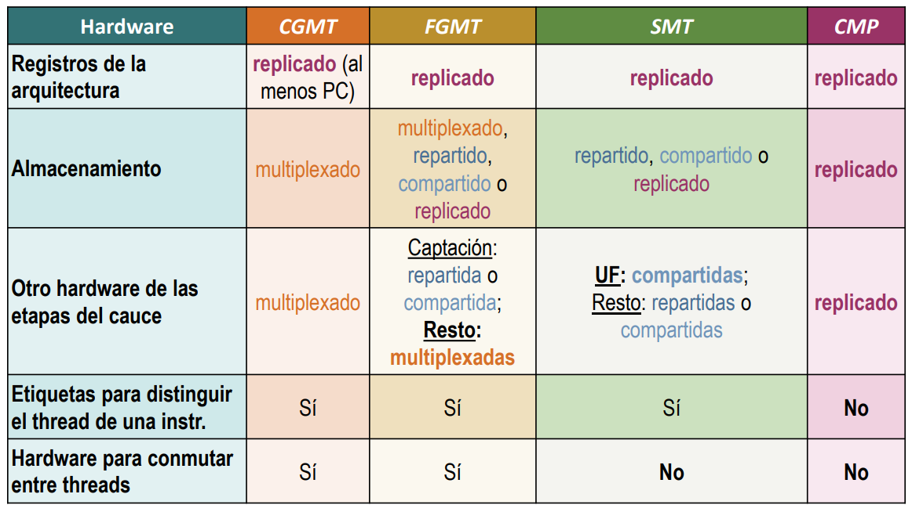

## Lección 8. Coherencia del sistema de memoria

> Ver lección 1: comunicación uno-a-uno en multiprocesador

###### Computadores que implementan en hardware mantenimiento de coherencia

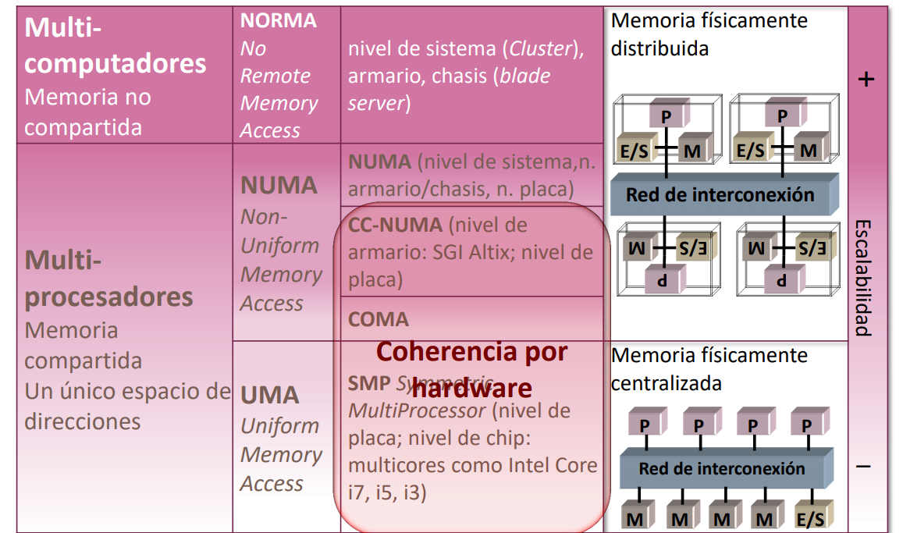

### Sistema de memoria en multiprocesadores

Está formado por:

* Cachés de todos los nodos
* Memoria principal
* Controladores
* Buffers (de escritura/almacenamiento, que combinan escrituras/almacenamientos, etc.)
* Medio de comunicación entre todos estos componentes (red de interconexión)

La comunicación de datos entre procesadores la realiza el sistema de memoria.

* La lectura de una dirección debe devolver lo último que se ha escrito (desde el punto de vista de todos los componentes del sistema).

> Ver lección 1: comunicación uno-a-uno en multiprocesador

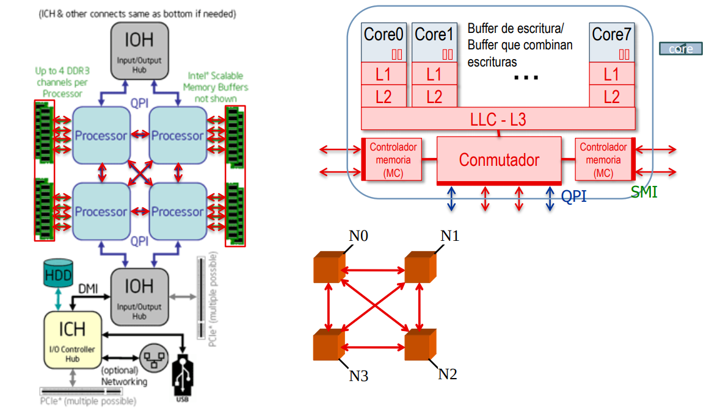

### Concepto de coherencia en el sistema de memoria: situaciones de incoherencia y requisitos para evitar problemas en estos casos

#### Incoherencia en el sistema de memoria

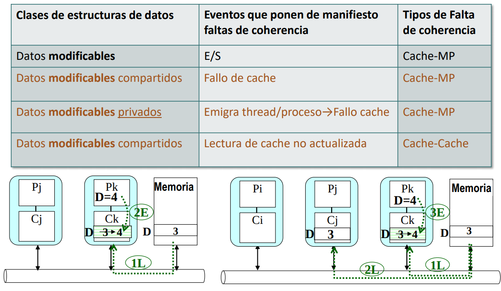

#### Métodos de actualización de memoria principal implementados en cachés

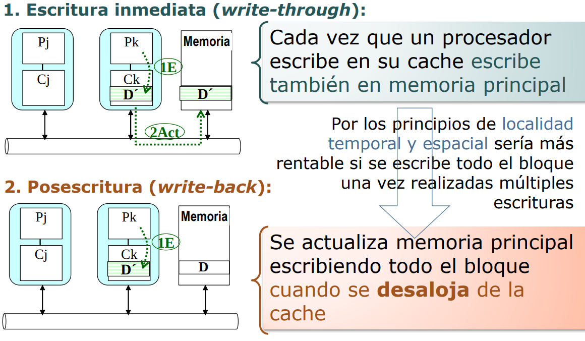

#### Alternativas para propagar una escritura en protocolos de coherencia de caché

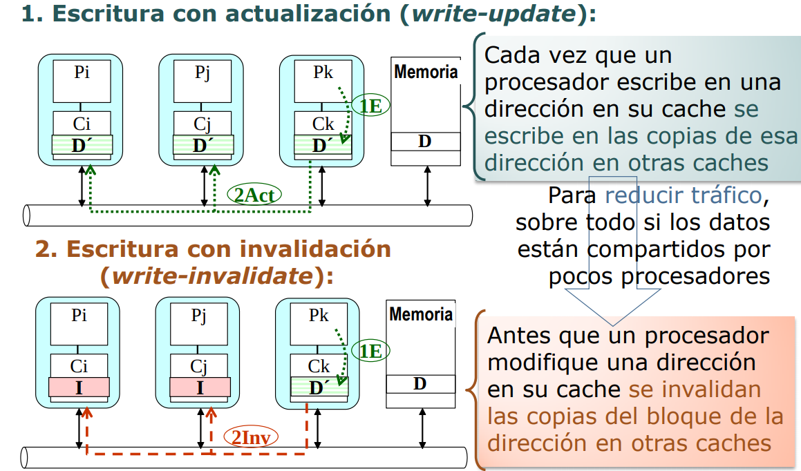

#### Situación de incoherencia aunque se propagan las escrituras (usa _difusión_)

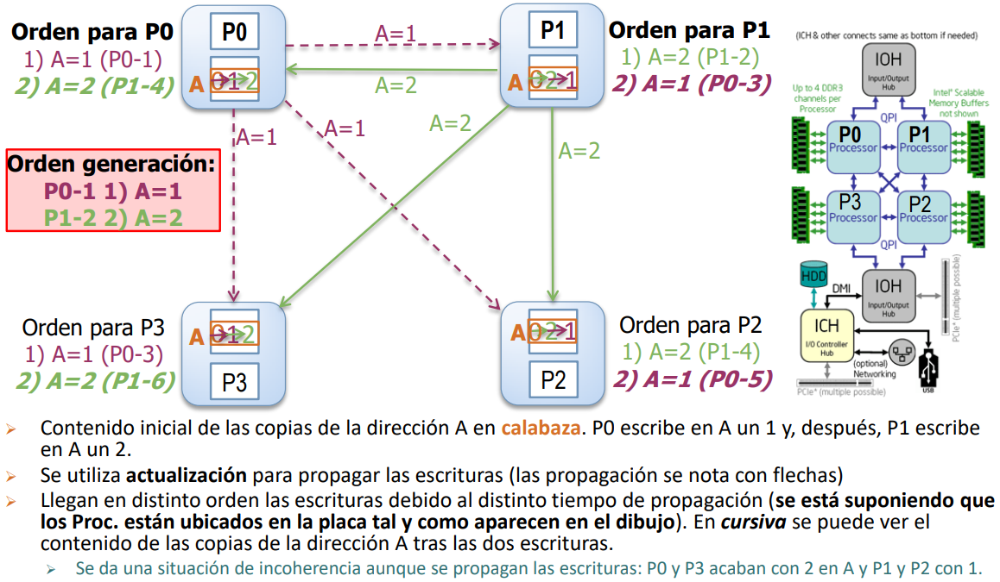

#### _Requisitos_ del sistema de memoria para evitar problemas por incoherencia

* **Propagar** las escrituras en una dirección.
  * La escritura en una dirección debe hacerse visible en un tiempo finito a otros procesadores.
  * Componentes conectados con un bus: los paquetes de actualización/invalidación son visibles a todos los nodos conectados al bus (controladores de cache).
* **Serializar** las escrituras en una dirección.
  * Las escrituras en una dirección deben verse en el mismo orden por todos los procesadores (el sistema de memoria debe **parecer** que realiza en serie las operaciones de escritura en la misma dirección).
  * Componentes conectados con un bus: el orden en que los paqutes aparecen en el bus determina el orden en el que se ven por todos los nodos.

**La red no es un bus**

* Propagar las escrituras en una dirección.
  * Usando difusión:
    * Los paquetes de actualización/invalidación se envían a todas las caches.
  * Para conseguir mayor escalabilidad:
    * Se debería enviar paquetes de actualización/invalidación sólo a caches (nodos) con copia del bloque.
    * Mantener en un directorio, para cada bloque, los nodos con copia del mismo.
* Serializar escrituras en una dirección
  * El orden en el que las peticiones de escritura llegan a su _home_ (nodo que tiene en MP la dirección) o al directorio centralizado sirve para serializar en sistemas de comunicación que garantizan el orden de transferencias entre dos puntos.

#### Directorio de memoria principal

##### Alternativas para implementar el directorio

| Centralizado                                                 | Distribuido                                                  |
| ------------------------------------------------------------ | ------------------------------------------------------------ |
| Compartido por todos los nodos                               | Las filas se distribuyen entre todos los nodos               |
| Contiene información de los bloques de todos los módulos de memoria | Típicamente el directorio de un nodo contiene información de los bloques de sus módulos de memoria |
| 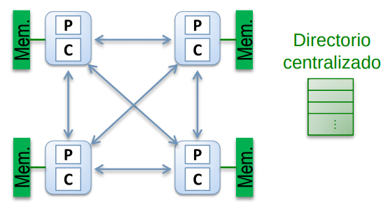                             | 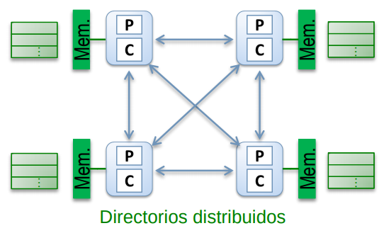                             |

###### Serialización de las escrituras por el home. Usando _difusión_

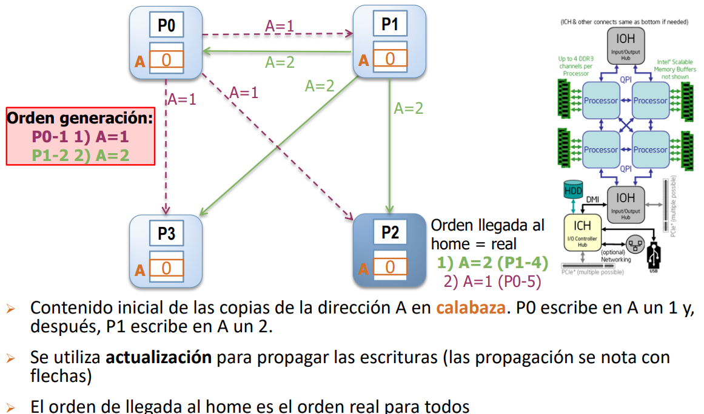

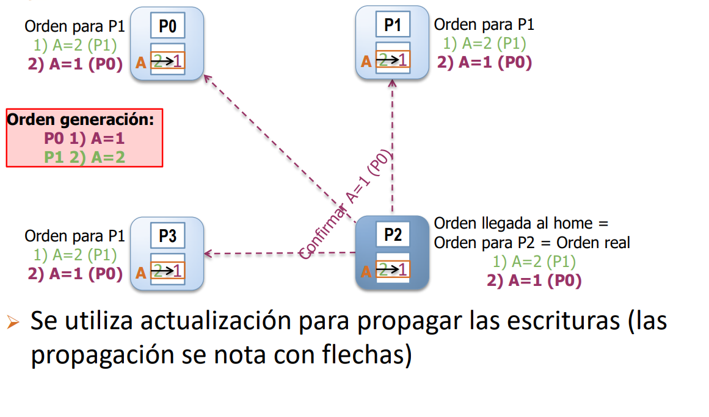

###### Serialización de las escrituras por el home. _Sin difusión y con directorio distribuido_

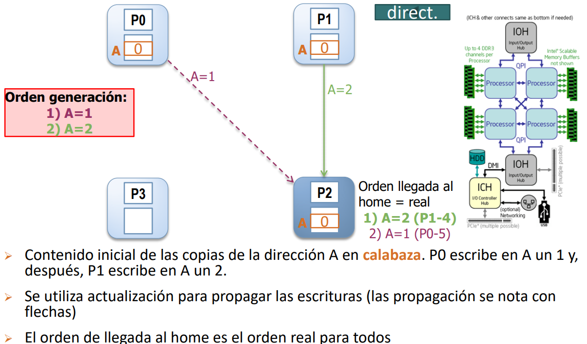

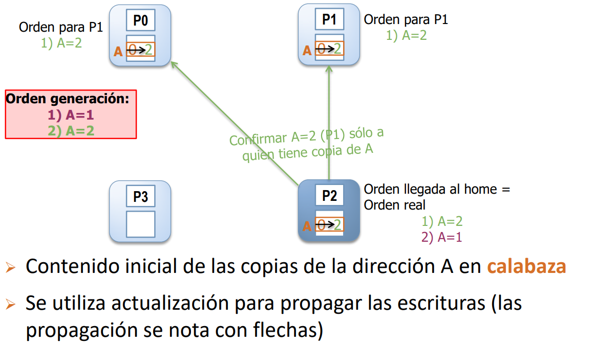

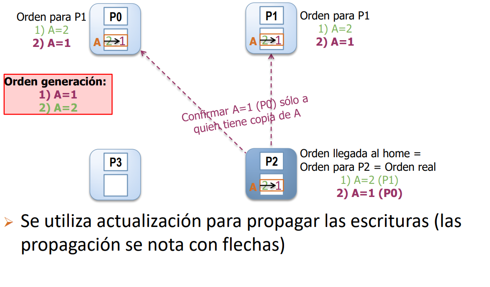

### Protocolos de mantenimiento de coherencia: clasificación y diseño

#### Clasificación de protocolos para mantener coherencia en sistema de memoria

* **Protocolos de espionaje (_snoopy_):** hace que las cachés individualmente monitoreen las líneas (buses) de direcciones de accesos a memoria con respecto a los bloques que han copiado. Cuando una operaciń de escritura es observada sobre una dirección de un bloque del cual tiene un bloque, el controlador de caché invalida su copia. También es posible que el controlador de caché observe la dirección y el dato correspondiente a la dirección, intentando así actualizar su copia cuando alguien modifica dicho bloque en la memoria principal.
  * Para buses, y en general sistemas con una difusión eficiente (bien porque el número de nodos es pequeño o porque la red implementa difusión).
  * Suele ser rápido, si hay suficiente ancho de banda disponible, ya que todas las transacciones son una petición/respuesta vista por todos los procesadores. No es escalable: como todas las peticiones deben ser difundidas a todos los nodos, cuando el sistema aumente el tamaño (lógico o físico) del bus y del ancho de banda debe incrementarse.
* **Protocolos basados en directorios:** mantienen un directorio centralizado de los bloques que hay en las cachés. Éste actúa como un filtro a través del que el procesador debe "pedir permiso" para cargar una entrada de memoria principal a su caché. Cuando se carga una entrada, el directorio se actualiza o invalida otras cachés con esa entrada.
  * Se usan tanto en multiprocesadores con memoria físicamente distribuida como en sistemas con memoria centralizada con red escalable: para redes sin difusión o escalables (multietapa y estáticas).
  * Reducen el tráfico en la red enviando selectivamente órdenes sólo a aquellas cachés que disponen de una copia válida del bloque implicado en la operación de memoria.
  * Tienden a tener mayor latencia, pero utilizan mucho menos ancho de banda: los mensajes son punto-a-punto, no difusiones.
* **Esquemas jerárquicos:** para redes jerárquicas -- jerarquía de buses, jerarquía de redes escalables, redes escalables-buses.

#### Facetas de diseño lógico en protocolos para coherencia

* Política de actualización de MP: escritura inmediata, <u>posescritura</u>, mixta.
* Política de coherencia entre cachés: <u>escritura con invalidación</u>, escritura con actualización, mixta.
* Describir comportamiento:
  * Definir posibles estados de los bloques en caché, y en memoria.
  * Definir transferencias (indicando nodos que intervienen y orden entre ellas) a generar ante eventos:
    * Lecturas/escrituras del procesador del nodo.
    * Como consecuencia de la llegada de paquetes de otros nodos.
  * Definir transiciones de estados para un bloque en caché, y en memoria.

### Protocolo MSI de espionaje de tres estados

Estados de un bloque en caché:

* **Modificado, M:** el bloque ha sido modificado en la caché, y es la única copia del bloque válida en todo el sistema. Los datos en la caché son inconsistentes con memoria. Un bloque en este estado tiene la responsabilidad de escribir el bloque a memoria cuando es desalojado.
* **Compartido, C ó S:** este bloque no ha sido modificado y existe en un estado solo lectura en al menos una caché. La caché puede desalojar los datos sin escribirlos de vuelta en memoria. Está válido, también válido en memoria y puede que haya copia válida en otras cachés.
* **Inválido, I:** el bloque no está presente en la caché o ha sido invalidado por una petición de bus, y debe ser extraído de memoria o de otra caché. Se ha invalidado o no está físicamente.

> * Cuando una **petición de lectura** llega a una caché en M o S, la caché proporciona los datos.
> * Si el bloque no está en caché (I), debe verificar que no está en M en cualquier otra caché. Dependiendo de la arquitectura esto se administra de una forma u otra:
>   * Arquitecturas de bus hacen _snooping_: la petición de lectura se difunde a todas las otras caché.
>   * Otros sistemas incluyen _directorios de caché_ que conocen qué cachés tienen la última copia de un bloque específico.
> * Si otra caché tiene el bloque en M, debe reescribir el bloque de vuelta e ir a los estados S o I.
> * Cuando cualquier M se escriba de vuelta, la caché obtiene de vuelta el bloque de la memoria o de otra caché con los datos en S. La caché puede entonces proporcionar los datos, permaneciendo en S tras esto.
> * Cuando una **petición de escritura** llega a un bloque en M, la caché modifica los datos localmente. Si el bloque está en S, debe notificar a otras cachés que puedan contener el bloque en S que deben desalojarlo (esto se hace con snooping o directorios caché). Entonces, los datos podrán ser modificados localmente.
> * Si el bloque está en I, la caché debe notificar a otras cachés que puedan contener el bloque en S o M que deben desalojarlo.
> * Si el bloque está en otra caché con M, la caché debe escribir los datos en memoria o proporcionarlas a la caché que lo pida. Si llegado a este punto la caché todavía no tiene el bloque localmente, el bloque se lee desde memoria antes de ser modificado en caché. Una vez que se modifiquen los datos, el bloque de caché estará en M.

Estados de un bloque en memoria (en realidad se evita almacenar esta información):

* **Válido:** puede haber copia válida en una o varias cachés.
* **Inválido:** habrá copia válida en una caché.

Transferencias generadas por un nodo con caché (tipos de paquetes):

* PrLec: petición del procesador para leer un bloque de caché.
* PrEsc: petición del procesador para escribir un bloque de caché.
* Petición de lectura de un bloque (PtLec): cuando un fallo de lectura ocurre en el caché de un procesador, envía una PtLec y espera recibir el bloque de caché.
* Petición de acceso exclusivo (PtLecEx): cuando un fallo de escritura ocurre en el caché de un procesador, envía una PtLecX, que devuelve el bloque de caché e invalida el bloque en las cachés de otros procesadores. Ocurre cuando escribe en un bloque *compartido* o *inválido*.
* Petición de posescritura (PtPEsc): por reemplazo del bloque _modificado_ (el procesador del nodo no espera respuesta).
* Respuesta con bloque (RpBloque): se devuelven los bloques modificados de memoria, solicitado por PtLec o PtLecEx.

###### Diagrama MSI de transiciones de estados

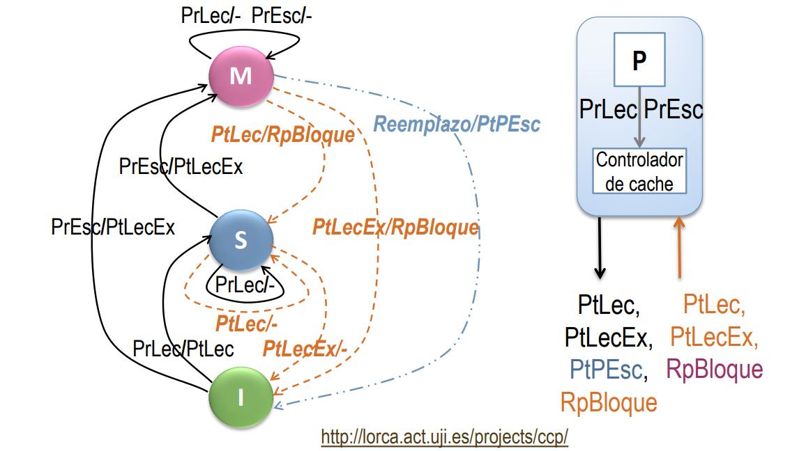

###### Tabla de descripción de MSI

| Est. Act.          | Evento        | Acción                                                       | Siguiente  |
| ------------------ | ------------- | ------------------------------------------------------------ | ---------- |
| **Modificado (M)** | PrLec/PrEsc   |                                                              | Modificado |
| M                  | PtLec         | Genera paquete respuesta (RpBloque)                          | Compartido |
| M                  | PtLecEx       | Genera paquete respuesta (RpBloque) Inválida copia local | Inválido   |
| M                  | _Reemplazo_   | _Genera paquete posescritura (PtPEsc)_                       | _Inválido_ |
| **Compartido (S)** | PrLec         |                                                              | Compartido |
| S                  | PrEsc         | Genera paquete PtLecEx (PtEx)                                | Modificado |
| S                  | PtLec         |                                                              | Compartido |
| S                  | PtLecEx       | Invalida copia local                                         | Inválido   |
| **Inválido (I)**   | PrLec         | Genera paquete PtLec                                         | Compartido |
| I                  | PrEsc         | Genera paquete PtLecEx                                       | Modificado |
| I                  | PtLec/PtLecEx |                                                              | Inválido   |

### Protocolo MESI de espionaje de cuatro estados

Estados de un bloque en caché:

* **Modificado, M:** el bloque está presente únicamente en la caché actual, y está _sucio_ (ha sido modificado del valor de memoria). Es necesario que vuelva a escribir a memoria en el futuro, antes de que se permita cualquier lectura del (no válido) estado de memoria. Esta lectura de vuelta cambia la línea a estado compartido, S.
* **Exclusivo, E:** el bloque está presente sólo en la caché actual, pero está _limpio_ (coincide con el valor de memoria). Podrá ser cambiado a S en cualquier momento, en respuesta a una petición de lectura. Alternativamente, podrá cambiarse a M en caso de escritura.
* **Compartido, C ó S:** indica que este bloque puede estar almacenado en otras cachés y está _limpio_. El bloque podrá ser descartado (cambiado a estado I) en cualquier momento.
* **Inválido, I:** indica que el bloque es inválido (no usado).

Estados de un bloque en memoria:

* **Válido:** puede haber copia válida en una o varias cachés.
* **Inválido:** habrá copia válida en una caché.

###### Diagrama MESI de transiciones de estados

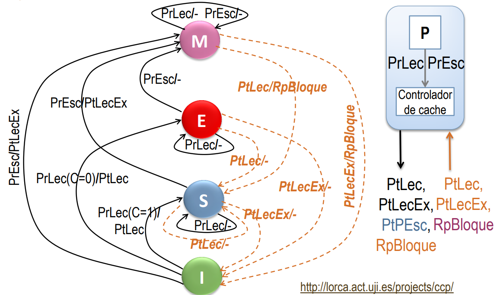

###### Tabla de descripción de MESI

| Est. Act.          | Evento        | Acción                                                       | Siguiente  |
| ------------------ | ------------- | ------------------------------------------------------------ | ---------- |
| **Modificado (M)** | PrLec/PrEsc   |                                                              | Modificado |
| M                  | PtLec         | Genera RbBloque                                              | Compartido |
| M                  | PtLecEx       | Genera RpBloque Invalida copia local                    | Inválido   |
| M                  | _Reemplazo_   | _Genera PtPEsc_                                              | Inválido   |
| **Exclusivo (E)**  | PrLec*        |                                                              | Exclusivo  |
| E                  | PrEsc*        |                                                              | Modificado |
| E                  | PtLec*        | (Implica una lectura en otra caché)                          | Compartido |
| E                  | PtLecEx*      | Invalida copia local                                         | Inválido   |
| **Compartido (S)** | PrLec/PtLec   |                                                              | Compartido |
| S                  | PrEsc         | Genera PtLecEx, otras cachés marcan sus copias como Inválido | Modificado |
| S                  | PtLecEx       | Invalida copia local (la caché que envió PtLecEx se hace Modificada) | Inválido   |
| **Inválido (I)**   | PrLec (C=1)   | (Si otras cachés tienen una copia no inválida) Genera PtLec | Compartido |
| I                  | PrLec (C=0)*  | (En otro caso) Genera PtLec                             | Exclusivo  |
| I                  | PrEsc         | Genera PtLecEx, otras cachés marcan sus copias como inválidas | Modificado |
| I                  | PtLec/PtLecEx | Señal ignorada                                               | Inválido   |

> *=fila tachada

### Protocolo MSI basado en directorios con o sin difusión

#### Protocolo MSI basado en directorios sin difusión

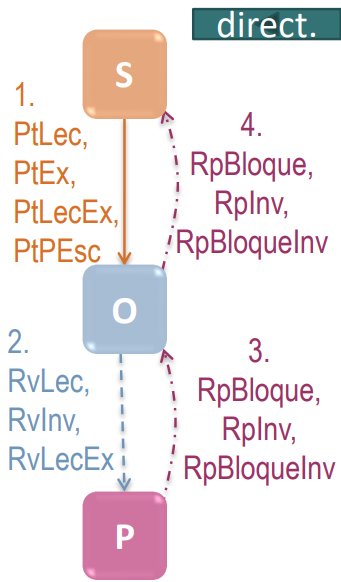

Estados de un bloque en caché:

* Modificado, M
* Compartido, C
* Inválido, I

Estados de un bloque en MP:

* Válido
* Inválido

Transferencias (tipos de paquetes):

* Tipos de nodos: solicitante (S), origen (O), modificado (M), propietario (P) compartido (C).
* Petición de S a O: lectura de un bloque (PtLec), lectura con acceso exclusivo (PtLecEx), peticiń de acceso exclusivo sin lectura (PtEx), posescritura (PtPEsc).
* Reenvío de petición de O a nodos con copia (P, M, C): invalidación (RvInv), lectura (RvLec, RvLecEx).
* Respuesta de nodo P a O: respuesta con bloque (RpBloque), respuesta con o sin bloque confirmando invalidación (RpInv, RpBloqueInv).
* Respuesta de nodo O a S: respuesta con bloque (RpBloque), respuesta con o sin bloque confirmando fin invalidación (RpInv, RpBloqueInv).

| 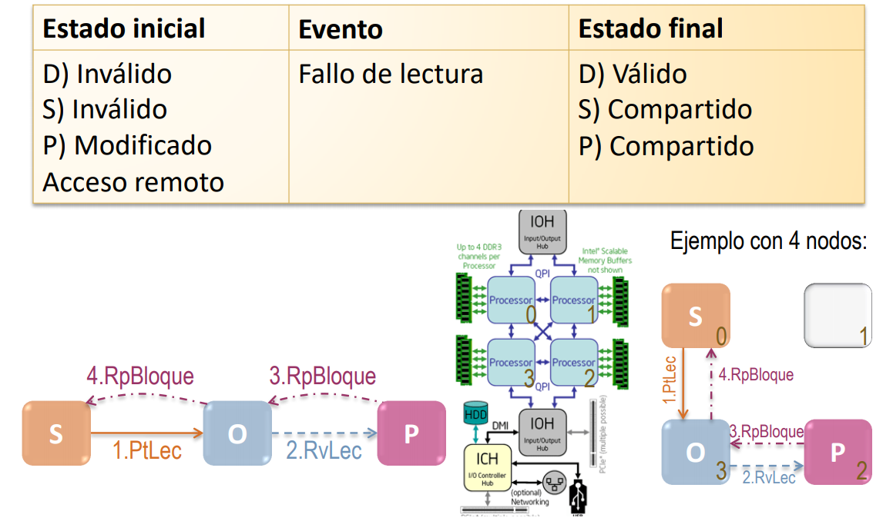 | 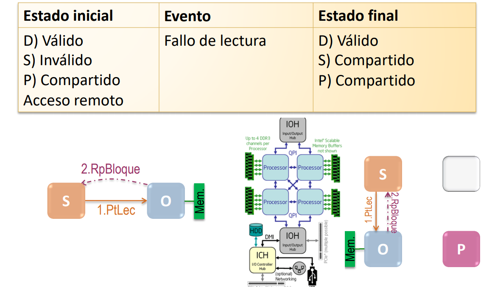 |
| -------------------------------- | -------------------------------- |
| 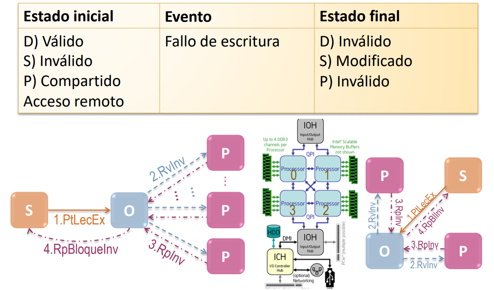 | 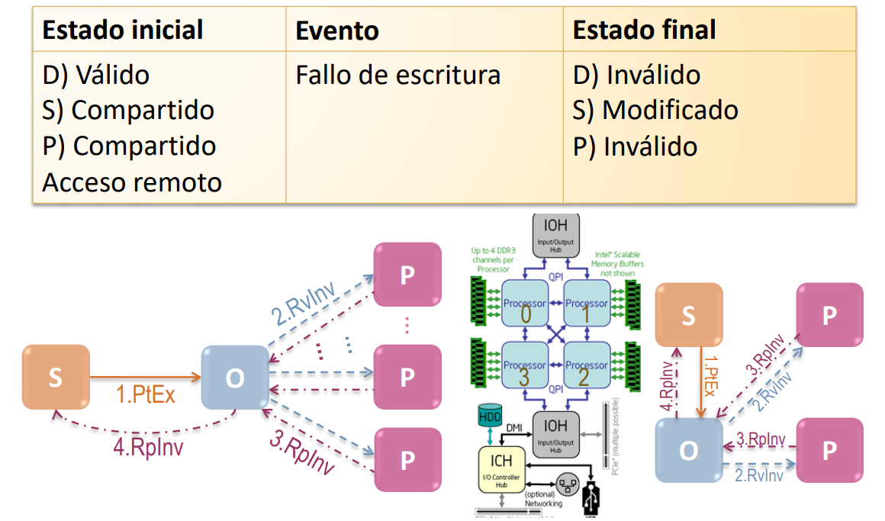 |
| 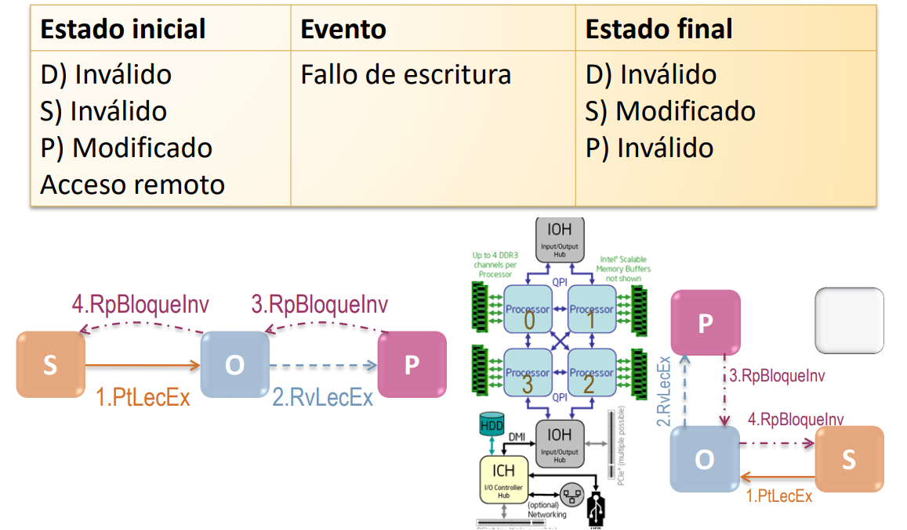 |                                  |

##### Protocolo MSI basado en directorios con difusión

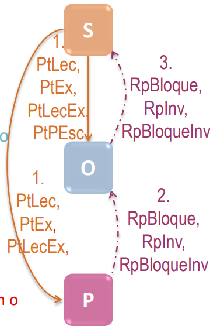

Estados de bloque en caché:

* Modificado, M
* Compartido, C
* Inválido, I

Estados de un bloque en MP:

* Válido
* Inválido

Transferencias (tipos de paquetes):

* Tipos de nodos: solicitante (S), origen (O), modificado (P), propietario (P), compartido (C).
* Difusión de petición del nodo S a O y P: lectura de un bloque (PtLec), lectura con acceso exclusivo (PtLecEx), petición de acceso exclusivo sin lectura (PtEx).
* Difusión de petición del nodo S a O: posescritura (PtPEsc).
* Respuesta de nodo P a O: respuesta con bloque (RpBloque), respuesta con o sin bloque confirmando invalidación (RpInv, RpBloqueInv).
* Respuesta de nodo O a S: respuesta con bloque (RpBloque), respuesta con o sin bloque confirmando fin invalidación (RpInv, RpBloqueInv).

|                                  |                                  |
| -------------------------------- | -------------------------------- |
| 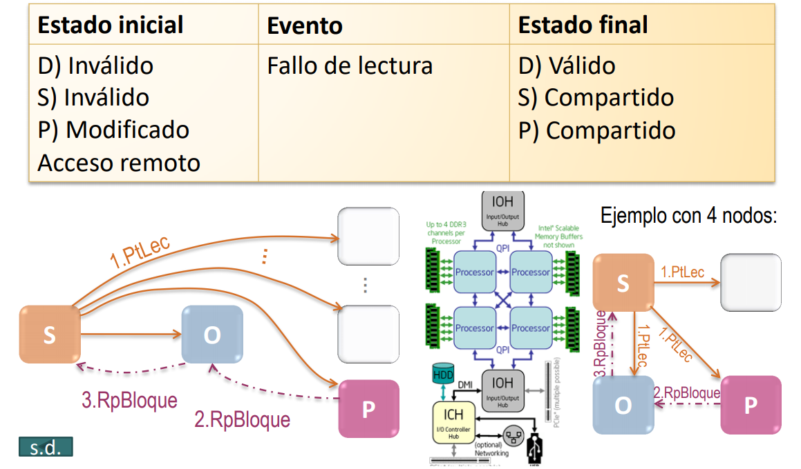 | 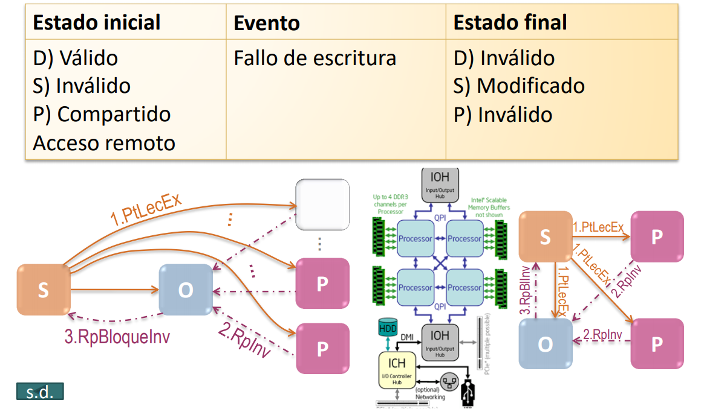 |

## Lección 9. Consistencia del sistema de memoria

### Concepto de consistencia de memoria

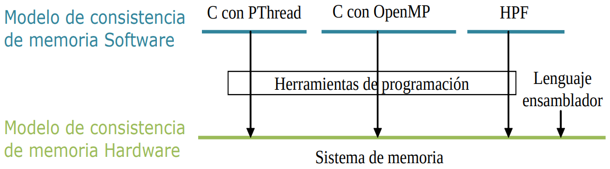

Un modelo de consistencia de memoria especifica (las restricciones en) el orden en el cual las operaciones de memoria (R/W) deben _parecer_ haberse realizado (operaciones a las mismas o distintas direcciones y emitidas por el mismo o distinto proceso/procesador).

La coherencia sólo abarca operaciones realizadas por múltiples componentes (proceso/procesador) en una misma dirección.

### Consistencia secuencial (SC)

SC es el modelo de consistencia que espera el programador de las herramientas de alto nivel. Éste require que:

* Todas las operaciones de un único procesador (thread) parezca ejecutarse en el orden descrito por el programa de entrada al procesador (**orden del programa**).
* Todas las operaciones de memoria parezcan ser ejecutadas una cada vez (**ejecución atómica**) -> serialización global.

SC presenta el sistema de memoria a los programadores como una **memoria global** conectada a todos los procesadores a través de un **conmutador central**.

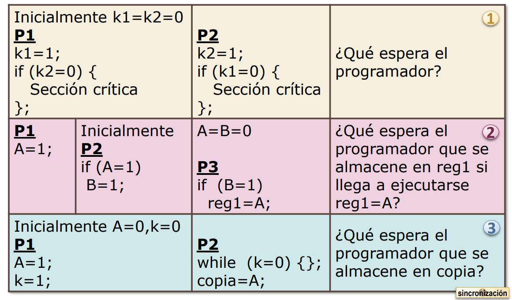

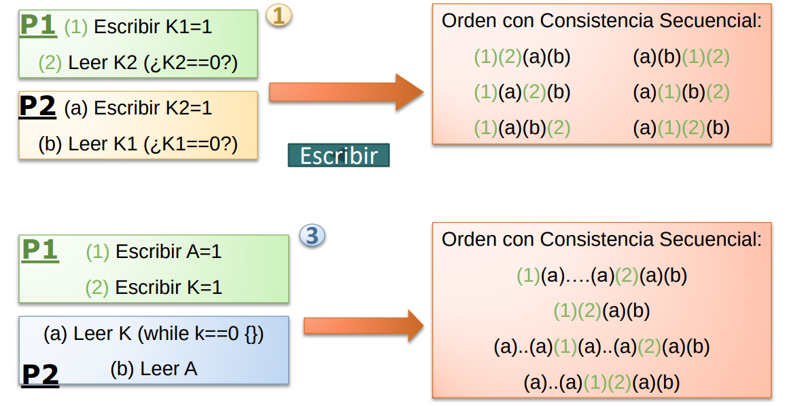

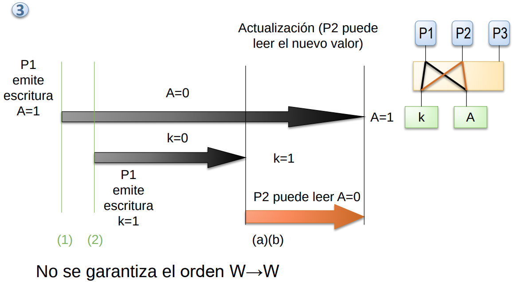

### Modelos de consistencia relajados

Difieren en cuanto a los requisitos para garantizar SC que relajan (los relajan para incrementar prestaciones):

* Orden del programa: hay modelos que permiten que se relaje en el código ejecutado en un procesador el orden entre dos accesos a distintas direcciones (W->R, W->W, R->RW).
* Atomicidad (orden global): hay modelos que permiten que un procesador pueda ver el valor escrito por otro antes de que este valor sea visible al resto de los procesadores del sistema.

Los **modelos relajados** comprenden:

* Los órdenes de acceso a memoria que no garantiza el sistema de memoria (tanto órdenes de un mismo procesador como atomicidad en las escrituras).
* Mecanismos que ofrece el hardware para garantizar un orden cuando sea necesario.

###### Ejemplos de modelos de consistencia hardware relajados

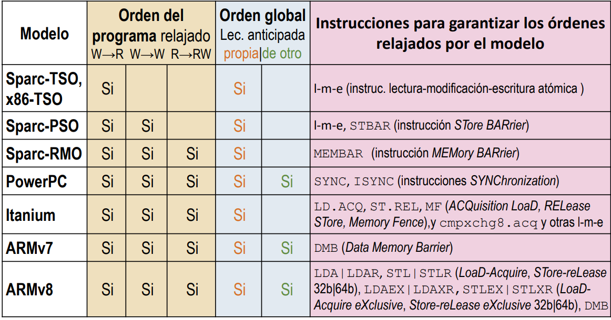

---

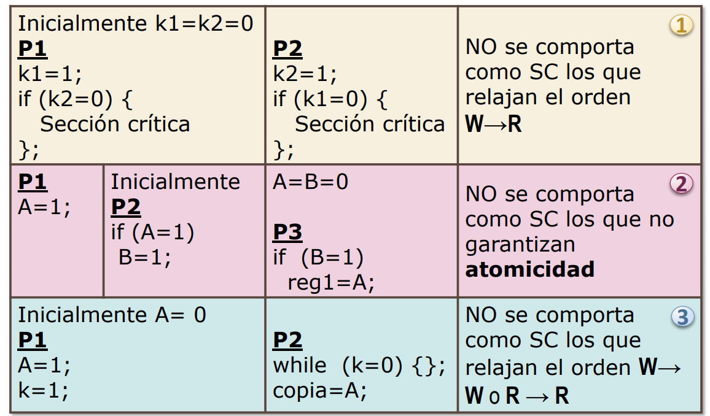

#### Modelo que relaja W->R

Permiten que una lectura pueda adelantar a una escritura previa en el orden del programa, pero evita dependencias RAW.

* Lo implementan sistemas con buffer (FIFO) de escritura para los procesadores (el buffer evita que las escrituras retarden la ejecución del código bloqueando lecturas posteriores).
* Generalmente permiten que el procesador pueda leer una dirección directamente del buffer (leer antes que otros procesadores una escritura propia).

Para garantizar un orden correcto se pueden utilizar instrucciones de serialización.

Hay sistemas en los que se permite que un procesador pueda leer la escritura de otro antes que el resto de procesadores (acceso no atómico).

* Para garantizar acceso atómico se pueden utilizar instrucciones de lectura-modificación-escritura atómicas.

#### Modelo que relaja W->R y W->W

Tiene buffer de escritura que permite que lecturas adelanten escrituras en el buffer.

Permiten que el hardware solape esrituras de memoria a distintas direcciones, de forma que pueden llegar a la memoria principal o a caches de todos los procesadores fuera del orden del programa.

En sistemas con este modelo se propociona hardware para garantizar los dos órdenes.

Este modelo no se comporta como SC en el siguiente ejemplo:

~~~
P1      P2
A=1;    while (k=0) {};
k=1;    copia=A;
~~~

#### Modelo de ordenación débil

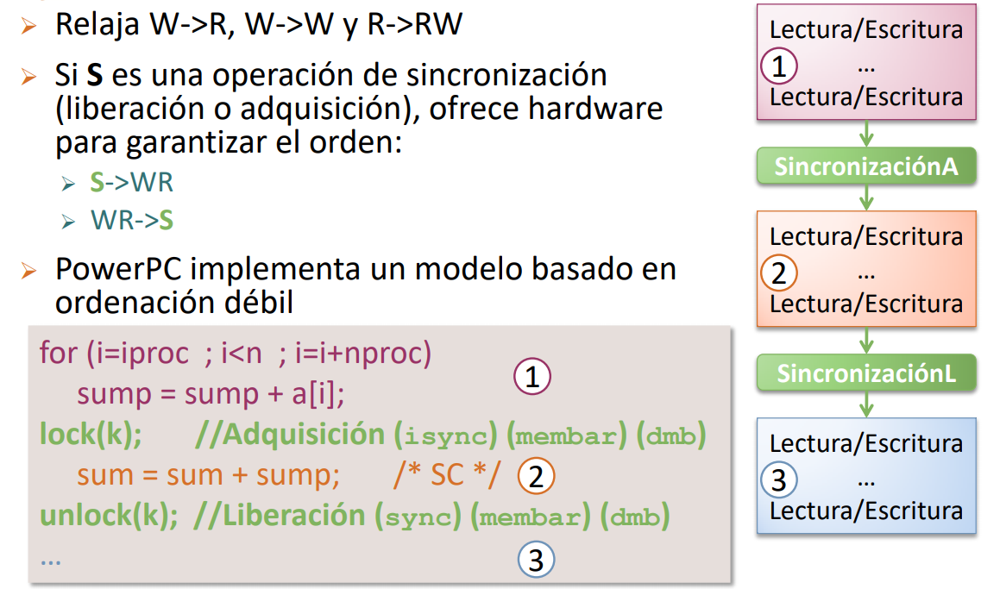

#### Consistencia de liberación

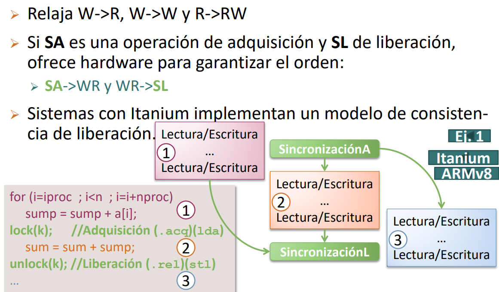

## Lección 10. Sincronización

### Comunicación en multiprocesadores y necesidad de usar código de sincronización

#### Necesidad de sincronización en:

* comunicación uno-a-uno:
  * Se debe garantizar que el proceso que recibe lea la variable compartida cuando el proceso que envía haya escrito en la variable el dato a enviar.
  * Si se reutiliza la variable para la comunicación, se debe garantizar que no se envía un nuevo dato en la variable hasta que no se haya leído el anterior.

> **Paralela** (inicialmente `K=0`)
>
> ~~~
> P1         P2
> ...        ...
> A=1;       while (K==0) {};
> K=1;       copia=A;
> ...        ...
> ~~~

* comunicación colectiva:
  * lectura-modificación-escritura debería hacerse en exclusión mutua (es una sección crítica) -> **cerrojos**.
    * **Sección crítica:** secuencia de instrucciones con una o varias direcciones compartidas (variables) que deben accederse en exclusión mutua.

> Ejemplo de comunicación colectiva: suma de `n` números
>
> **Secuencial**
>
> ~~~
> for (i=0; i<n; i++)
> 	sum = sum + a[i];
> printf(sum);
> ~~~
>
> **Paralela** (`sum=0`)
>
> ~~~
> for (i=thread; i<n; i=i+nthread)
> 	sump = sump + a[i];
> sum = sum + sump;	/* SC, sum compart. */
> if (ithread==0) printf(sum);
> ~~~
>
> El proceso 0 no debería imprimir hasta que no se hayan acumulado `sump` en `sum` para todos los procesos -> **barreras**.

### Soporte software y hardware para sincronización

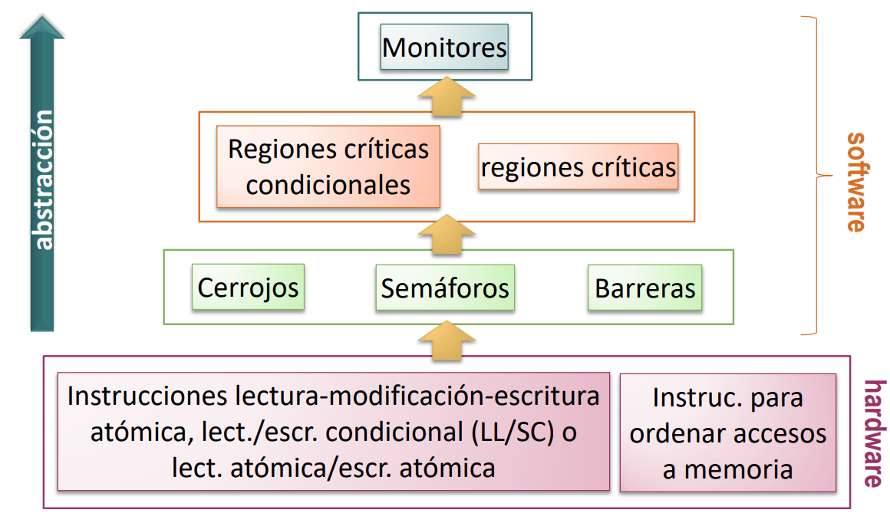

### Cerrojos

Permiten sincronizar mediante dos operaciones:

* **Cierre** del cerrojo o `lock(k)`: intenta _adquirir_ el derecho a acceder a una seccion crítica (_cerrando_ o _adquiriendo_ el cerrojo `k`).
  * Si varios procesos intentan el cierre a la vez, sólo uno de ellos lo debe conseguir, el resto debe pasar a una _etapa de espera_.
  * Todos los procesos que ejecuten `lock()` con el cerrojo cerrado deben quedar esperando.
* **Apertura** del cerrojo o `unlock(k)`: _libera_ a uno de los threads que esperan el acceso a una sección crítica (éste _adquiere_ el cerrojo).
  * Si no hay threads en espera, permitirá que el siguiente thread que ejecute la función `lock()` adquiera el cerrojo `k` sin espera.

> Cerrojo en el ejemplo suma:
>
> ~~~
> for (i=thread; i<n; i=i+nthread)
> 	sump = sump + a[i];
> lock(k);	// <===========
> sum = sum + sump;	/* SC, sum compart. */
> if (ithread==0) printf(sum);
> unlock(k);	// <===========
> ~~~

Alternativas para implementar la espera:

* Espera ocupada.
* Suspensión del proceso o thread, éste queda esperando en una cola, el procesador conmuta a otro proceso-thread.

#### Componentes en un código para sincronización

* Método de **adquisición**: método por el que un thread trata de adquirir el derecho a pasar a utilizar unas direcciones compartidas. Ej.:
  * Utilizando lectura-modificación-escritura atómicas: Intel x86, Intel Itanium, Sun Sparc.
  * Utilizando LL/SC (_Load Linked / Store Conditional_): IBM Power/PowerPC, ARMv7, ARMv8.
* Método de **espera**: método por el que un thread espera a adquirir el derech a pasar a utilizar unas direcciones compartidas:
  * Espera ocupada (_busy-waiting_).
  * Bloqueo.
* Método de **liberación**: método utilizado por un thread para liberar a uno (cerrojo) o varios (barrera) threads en espera.

#### Cerrojo simple

* Variable compartida `k` con dos valores: abierto (0), cerrado (1)
* **Apertura**: `unlock(k)` abre el cerrojo escribiendo un 0 (_operación **indivisible**_).
* **Cierre**: `lock(k)` lee el cerrojo y lo cierra escribiendo un 1.
  * Resultado de la lectura:
    * Si el cerrojo **estaba cerrado** el thread espera hasta que otro thread ejecute `unlock(k)`.
    * Si **estaba abierto** _adquiere_ el derecho a pasar a la sección crítica.
  * `leer-asignar_1-escribir` en el cerrojo debe ser ***indivisible*** _(atómica)_.
* Se debe añadir lo necesario para garantizar el acceso en exclusión mutua a `k` y el orden imprescindible en los accesos a memoria.

> `lock(k)`
>
> ~~~
> lock(k) {
>     while (leer-asignar_1-escribir(k) == 1 ){};
> } /* k compartida */
> ~~~
>
> `unlock(k)`
>
> ~~~
> unlock(k) {
>     k=0;
> } /* k compartida */
> ~~~

###### Cerrojos en OpenMP

| Descripción                                                  | Función de la biblioteca OpenMP |
| ------------------------------------------------------------ | ------------------------------- |
| Iniciar (estado `unlock`)                                    | `omp_init_lock(&k)`             |
| Destruir un cerrojo                                          | `omp_destroy_lock(&k)`          |
| Cerrar el cerrojo `lock(k)`                                  | `omp_set_lock(&k)`              |
| Abrir el cerrojo `unlock(k)`                                 | `omp_unset_lock(&k)`            |
| Cierre del cerrojo pero sin bloqueo (devuelve 1 si estaba cerrado y 0 si está abierto) | `omp_test_lock(&k)`             |

#### Cerrojos con etiqueta

Fija un orden FIFO en la adquisición del cerrojo (se debe añadir lo necesario para garantizar el acceso en exclusión mutua al contador de adquisición y el orden imprescindible en los accesos a memoria).

> `lock(contadores)`
>
> ~~~
> contador_local_adq = contadores.adq;
> contadores.adq = (contadores.adq + 1) mod max_flujos;
> while ( contador_local_adq <> contadores.lib ) {};
> ~~~
>
> !duda: <>? .adq, .lib
>
> `unlock(contadores)`
>
> ~~~
> contadores.lib = (contadores.lib + 1) mod max_flujos;
> ~~~

### Barreras

La función barrera se utiliza para sincronizar entre sí, en algún punto del código, los procesos que colaboran en la ejecución de un trozo de código. Las barreras
proporcionan un medio para asegurar que ningún proceso un punto del código hasta que todos los procesos hayan llegado a ese punto.

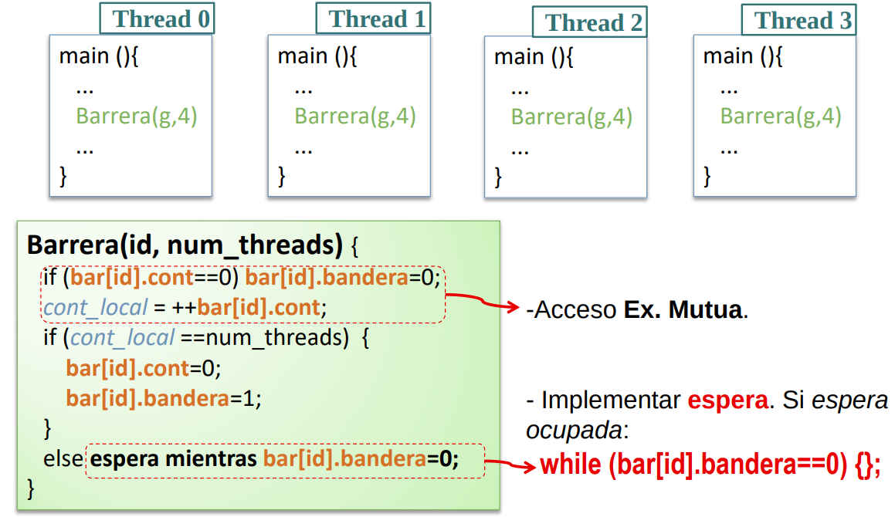

> Barrera _sense-reversing_ !?
>
> ~~~
> Barrera(id, num_procesos) {
> 	bandera_local = !(bandera_local) //se complementa bandera local
> 	lock(bar[id].cerrojo);
> 	cont_local = ++bar[id].cont //cont_local es privada
> 	unlock(bar[id].cerrojo);
> 	if (cont_local == num_procesos) {
> 		bar[id].cont = 0; //se hace 0 el cont. de la barrera
> 		bar[id].bandera = bandera_local; //para liberar thread en espera
> 	}
> 	else while (bar[id].bandera != bandera_local) {}; //espera ocupada
> }
> ~~~

### Apoyo hardware a primitivas software

#### Instrucciones de lectura-modificación-escritura atómicas

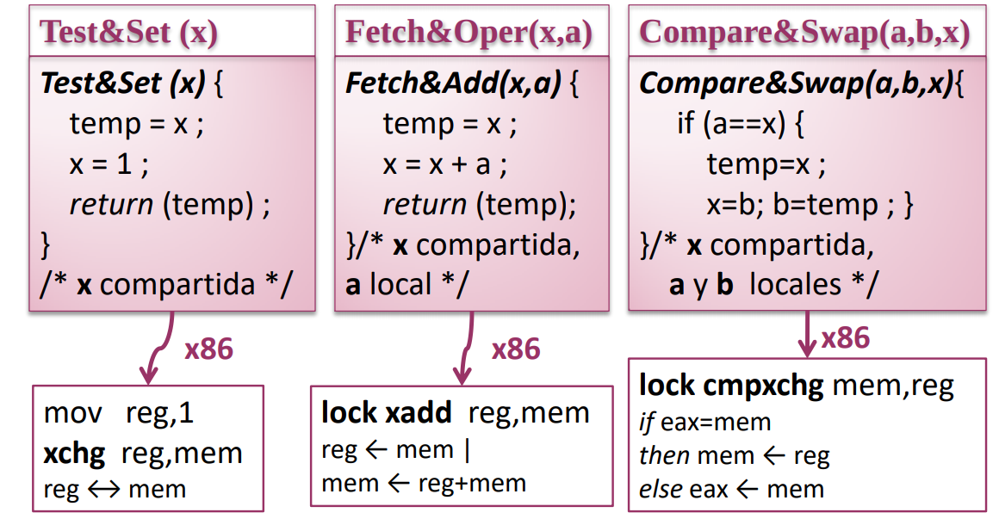

###### Cerrojos simples con `Test&Set`, `Fetch&Or` y `Compare&Swap`

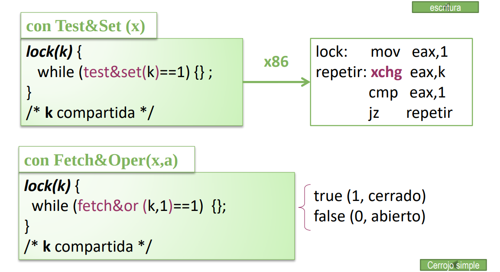

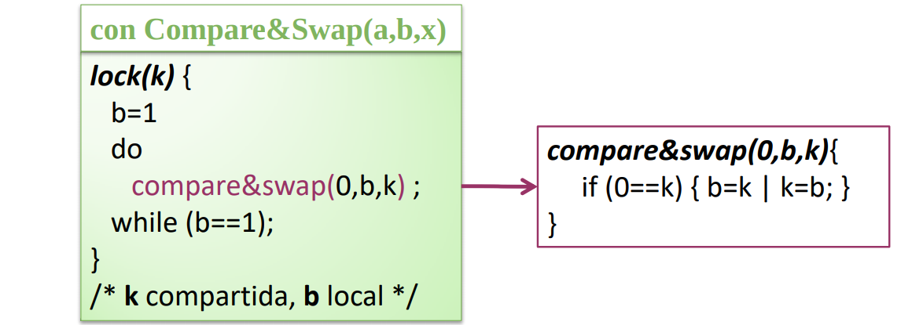

###### Cerrojo simple en Itanium (consistencia de liberación) con `Compare&Swap`

!consitencia de--?

###### Cerrojo simple en PowerPC (consistencia débil) con LL/SC implementando `Test&Set`

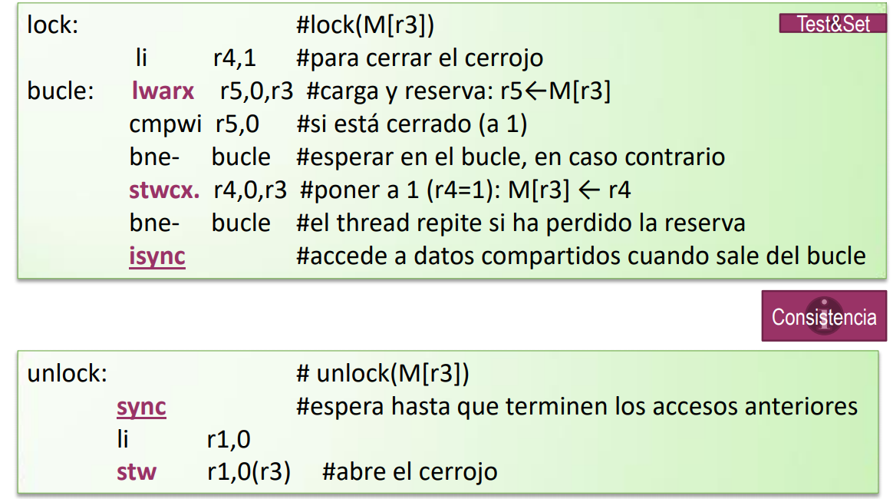

!LL/SC?

###### Cerrojo simple en ARMv7 (consistencia débil) con LL/SC implementando `Test&Set`

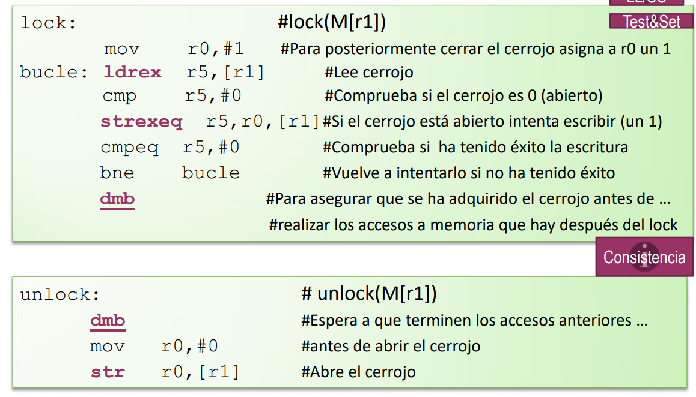

###### Cerrojo simple en ARMv8 (consistencia de liberación) con LL/SC para `Test&Set`

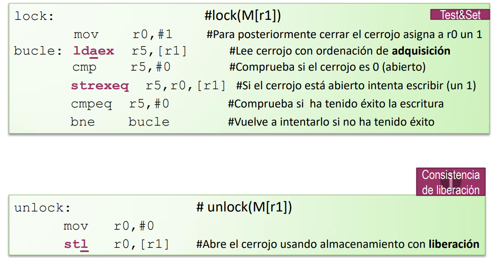

#### Algoritmos eficientes con primitivas hardware

